# Lab 1: Create your first app with Teams Toolkit

> #### 실습 계획 
> 
> *  [**Lab 1 - Create your first app with Teams Toolkit**](./2024-01-02-1.create-app.html) 이 랩에서는 Teams Toolkit을 설정하고 Teams 메시지 확장을 만드는 방법을 알아보겠습니다.
> * [**Lab 2 - Integrate business data with your application**](./2024-01-03-2.integrate-web-service.html) 이 실습에서는 새로운 앱을 'Northwind Suppliers’라고 브랜딩하고, Microsoft Teams 대화에서 Northwind Traders 샘플 데이터베이스의 데이터를 삽입할 수 있는 기능을 제공합니다. 또한 메시지 확장을 사용하여 어댑티브 카드를 생성하고 전송하는 방법을 배우게 됩니다.
> * [**Lab 3 - Add link unfurling**](./2024-01-04-3.add-link-unfurling.html) 이 랩에서는 사용자가 대화에 URL을 포함할 때 사용자 정의 요약을 제공하는 링크 언퍼링 기능을 사용하는 방법을 배우게 됩니다.
> * [**Lab 4 - Action message extensions with Open AI**](./2024-01-05-4.add-ai.html) 이 랩에서는 “액션” 메시지 확장 기능을 만드는 방법을 배울 수 있습니다. 이 기능은 직접 실행하거나 다른 팀 메시지의 컨텍스트 메뉴에서 실행하여 해당 메시지에 대한 작업을 수행할 수 있습니다. 이 랩에서는 Open AI 상업 웹 서비스(Azure 또는 Open AI 계정을 사용하여)를 이용하여 메시지를 생성합니다.
> * [**Lab 5 - Single Sign-on and Microsoft Graph**](./2024-01-06-5.add-sso.html) 이 실습에서는 Azure AD Single Sign-On을 사용하여 사용자를 인증하고 Microsoft Graph API를 호출하는 방법을 배웁니다. 이와 같은 과정은 로그인한 사용자를 대신하여 Azure AD로 보호되는 웹 서비스를 호출할 때 사용됩니다.
> * [**Lab 6 - Run the app in Outlook**](./2024-01-07-6.run-in-outlook.html) 이 랩에서는 Microsoft Outlook에서 Northwind Suppliers 애플리케이션을 실행합니다.
{: .block-tip }

## Overview

팀즈 앱 캠프의 핵심 원칙 중 하나는 처음부터 개발자들이 새로운 앱을 만들 뿐만 아니라 기존의 앱을 _재사용_하고 _재구성_하여 마이크로소프트 팀즈 앱으로 만들 수 있도록 돕는 것이었습니다. 이로 인해 팀즈 앱 캠프 랩은 일반적인 개발 도구를 사용하여 만들기로 결정했으며, 이를 통해 개발자들은 어떤 도구 체인을 사용하든 팀즈 앱을 구현할 수 있을 만큼 충분한 세부 정보를 알 수 있습니다.

Teams 앱을 만들기 위한 도구 - 특히 [Teams Toolkit](https://learn.microsoft.com/en-us/microsoftteams/platform/toolkit/teams-toolkit-fundamentals?pivots=visual-studio-code){:target="_blank"}은 그 이후로 많이 개선되었고, 많은 개발자들이 이러한 도구를 사용하여 새로운 확장 기능을 앱에 추가하고 있습니다. 이것이 이 새로운 연습 과정, __Teams App Camp: Next Adventure__ 의 시작입니다.

이 실습에서는 [Teams Toolkit for Visual Studio Code](https://aka.ms/teams-toolkit){:target="_blank"}를 사용하여 기존 웹 서비스를 Teams 앱으로 활용하는 방법을 배웁니다. 이 방법은 원하는 도구 체인을 선택할 수는 없지만, 새로운 Teams 앱을 작성하고 Microsoft Azure에 배포하는 것을 훨씬 쉽게 해줍니다.

이 실습에서는 다음을 배우게 됩니다:

- Visual Studio Code용 Teams Toolkit 설치하기
- 검색 기반 메시지 확장 기능이 있는 Teams 애플리케이션 만들고 실행하기

## Exercise 1: Set up your Microsoft 365 Subscription

자신의 Teams 앱을 설치하고 실행하려면 관리자 권한이 있는 Microsoft 365 테넌트가 필요합니다. 다행히 Microsoft 365 Developer Program을 통해 무료로 하나를 얻을 수 있습니다! 이후에 나오는 실습에서는 이 테넌트를 사용하여 Microsoft Teams를 실행할 것입니다.

### Step 1: Get a tenant

아직 테넌트가 없다면, [Microsoft 365 Developer Program](https://developer.microsoft.com/microsoft-365/dev-program?WT.mc_id=m365-58890-cxa){:target="_blank"}에 가입하여 무료로 하나를 받으세요. 테넌트에는 25개의 [E5 사용자 라이선스](https://www.microsoft.com/microsoft-365/enterprise/compare-office-365-plans?WT.mc_id=m365-58890-cxa){:target="_blank"}가 포함되어 있으며, 개발을 계속하면 갱신할 수 있습니다!

시작하려면 "지금 가입"을 선택하세요.
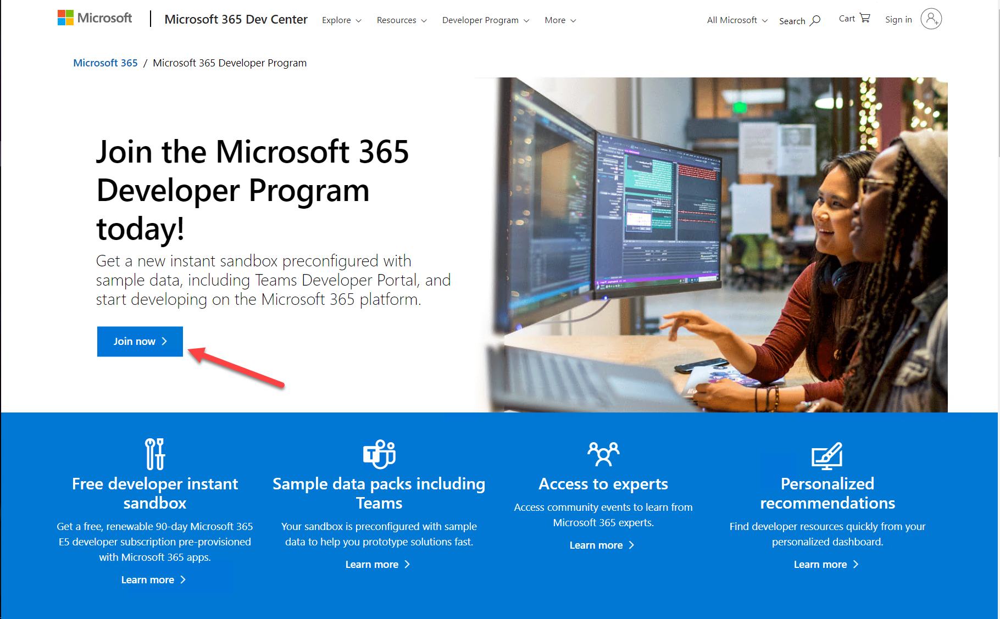

Microsoft 개인 또는 업무 및 학교 계정으로 로그인하고, 정보를 입력하고, "Next"을 선택하세요. 원하는 "sandbox" 유형을 선택할 수 있는 기회가 있습니다. "Instant sandbox"를 권장합니다.

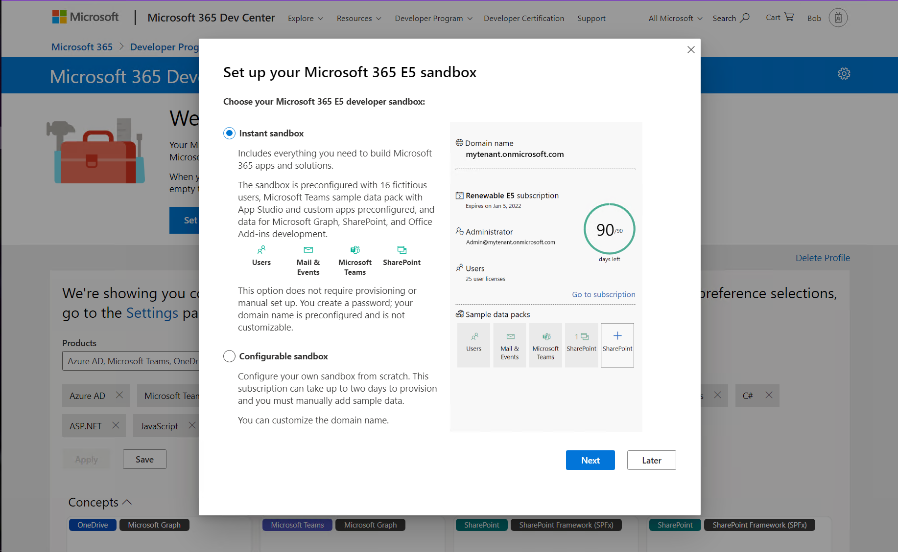

마법사를 따라 관리자 사용자 이름과 비밀번호, 테넌트 도메인 이름 등을 선택하세요. 도메인 이름은 가장 왼쪽에 있는 부분만 선택하면 됩니다. 예를 들어 "Contoso"를 입력하면 도메인은 "Contoso.onmicrosoft.com"이 됩니다.

이 정보를 기억하세요. 실습을 진행하는 동안 계속 필요합니다! &gt;username&lt;@&gt;domain&lt;.onmicrosoft.com으로 로그인하고, 선택한 비밀번호를 사용하세요. 전화 번호를 입력하라는 메시지가 나타나면 입력하세요. 그런 다음 시스템이 구독을 설정합니다.

새로운 테넌트에 로그인하라는 메시지가 나타나면, 방금 만든 새로운 관리자 자격 증명을 사용하세요. 개발자 프로그램에 가입할 때 사용한 자격 증명이 아닙니다.

> #### 다수의 테넌트를 탐색하는 방법
>
> 각 테넌트마다 자신의 즐겨찾기, 저장된 자격 증명, 쿠키를 가지는 브라우저 프로필을 만들어 보세요. 그러면 작업하면서 테넌트 간에 쉽게 전환할 수 있습니다.
{: .block-warning }

> #### 다중 인증 요소(MFA)를 활성화하라는 요청을 받을 수 있습니다.
> 
> 이건 정말 [좋은 생각](https://www.microsoft.com/security/blog/2019/08/20/one-simple-action-you-can-take-to-prevent-99-9-percent-of-account-attacks/){:target="_blank"}이에요! 지시사항을 따라주시면 돼요. 만약 MFA를 꼭 끄고 싶다면, [이렇게](https://docs.microsoft.com/en-us/answers/questions/101179/how-to-disable-the-two-factor-authentication-from.html){:target="_blank"} 하시면 됩니다.
{: .block-tip }

> #### Microsoft 365 개발 테넌트를 설정하는 데 도움이 되는 팁 더 알아보기!
>
> <iframe src="//www.youtube.com/embed/DhhpJ1UjbJ0" frameborder="0" allowfullscreen></iframe>
> Microsoft 365 개발 테넌트 설정하기
{: .block-warning }

### Step 2: Enable Teams application uploads

기본적으로 최종 사용자는 Teams 애플리케이션을 직접 업로드할 수 없으며, 대신 관리자가 엔터프라이즈 앱 카탈로그에 업로드해야 합니다. 이 단계에서는 테넌트가 Teams Toolkit(또는 Teams 자체)에 의한 직접 업로드를 위해 설정되어 있는지 확인합니다.

  a. [Microsoft 365 관리 센터]인 [https://admin.microsoft.com/](https://admin.microsoft.com/){:target="_blank"}로 이동합니다.

  b. 관리 센터의 왼쪽 패널에서 "모두 표시"를 선택하여 전체 탐색을 엽니다.

  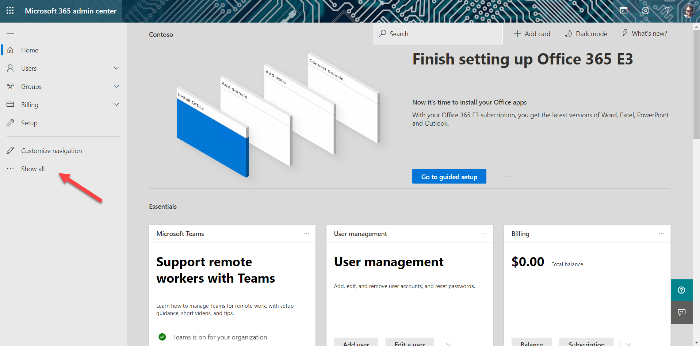

  패널이 열리면 Teams를 선택하여 Microsoft Teams 관리 센터를 엽니다.

  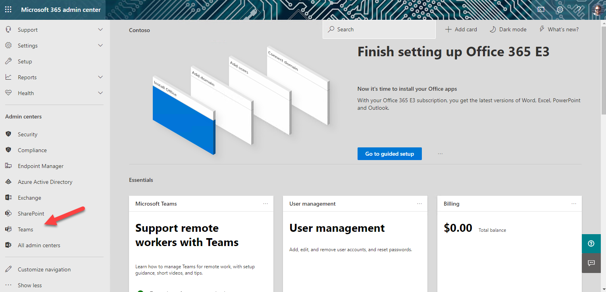

  c. Microsoft Teams 관리 센터의 왼쪽에서 Teams 앱 아코디언 1️⃣을 열고 설정 정책 2️⃣을 선택합니다. 앱 설정 정책 목록이 표시됩니다. 전역(조직 전체 기본값) 정책 3️⃣을 선택합니다.

  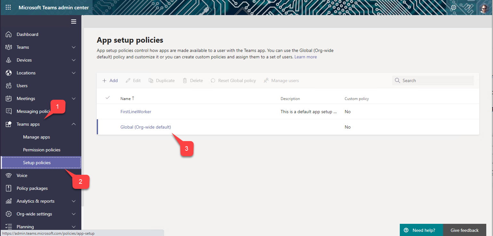

 d. "사용자 지정 앱 업로드" 스위치가 켜져 있는지 확인합니다.

 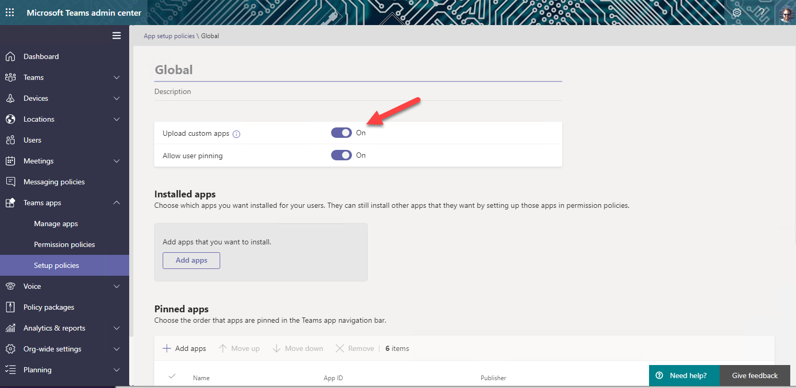

아래로 스크롤하여 변경 사항을 유지하기 위해 "저장" 버튼을 반드시 선택합니다.

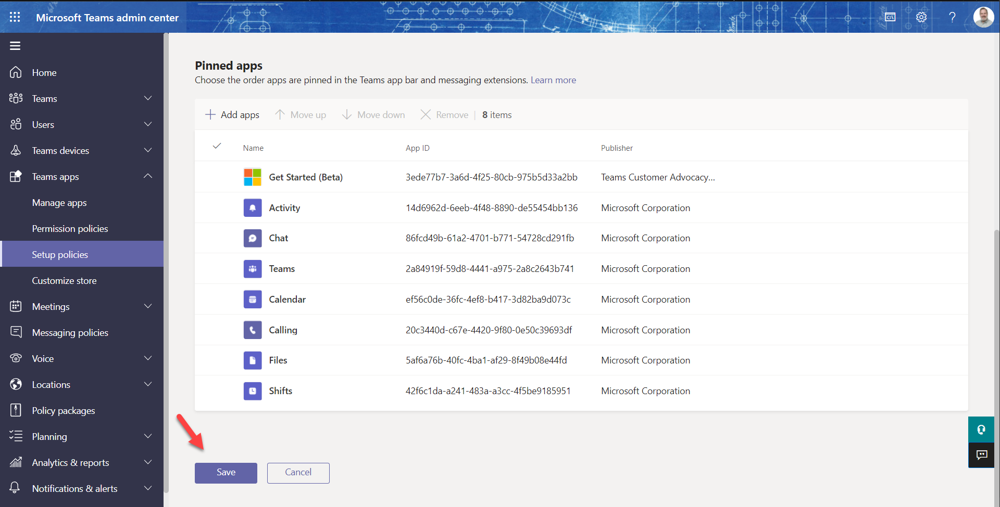
 
 이 기능은 개발자 테넌트에서 기본적으로 활성화되도록 작업하고 있으므로 이미 설정되어 있을 수 있습니다. 변경 사항이 적용되는 데 최대 24시간이 걸릴 수 있지만, 대개는 훨씬 빠릅니다.

## Exercise 2: Install Teams Toolkit and prerequisites

이러한 실습은 Windows, Mac, 또는 Linux 컴퓨터에서 수행할 수 있지만, 필수 조건을 설치할 수 있는 능력이 필요합니다. 컴퓨터에 애플리케이션을 설치할 수 없다면, 워크샵을 진행하는 동안 사용할 수 있는 다른 컴퓨터(또는 가상 머신)을 찾아야 합니다.

### Step 1: Install Visual Studio Code

[Teams Toolkit for Visual Studio Code]()가 Visual Studio Code를 필요로 한다는 것은 놀랍지 않습니다! 여기서 다운로드할 수 있습니다: [Visual Studio Code](https://code.visualstudio.com/download){:target="_blank"}.

### Step 2: Install NodeJS

NodeJS는 컴퓨터에서 JavaScript를 실행할 수 있게 해주는 프로그램입니다. NodeJS는 Microsoft Edge와 Google Chrome과 같은 인기 있는 웹 브라우저에서 사용되는 오픈 소스 “V8” 엔진을 사용합니다. 이 워크샵에서 사용하는 웹 서버 코드를 실행하려면 NodeJS가 필요합니다.

[https://nodejs.org/en/download/](https://nodejs.org/en/download/){:target="_blank"}로 이동하여 운영 체제에 맞는 버전 18.x, “LTS” (Long Term Support) 버전을 설치하세요. 이 실습은 NodeJS 버전 18.16.0을 사용하여 테스트되었습니다. 이미 다른 버전의 NodeJS를 설치한 경우, [Node Version Manager](https://github.com/nvm-sh/nvm){:target="_blank"} (또는 Microsoft Windows용 [이 변형](https://github.com/coreybutler/nvm-windows){:target="_blank"} )을 설정하는 것이 좋습니다. 이것은 같은 컴퓨터에서 Node 버전을 쉽게 전환할 수 있게 해줍니다.

### Step 3: Install Teams Toolkit

이 랩은 [Teams Toolkit version 5.0](https://marketplace.visualstudio.com/items?itemName=TeamsDevApp.ms-teams-vscode-extension){:target="_blank"}을 기반으로 합니다.
아래 스크린 샷에 나와 있는 단계를 따라하세요.

1️⃣ Visual Studio Code를 열고 확장 도구 모음 버튼을 클릭하세요

2️⃣ "Teams"를 검색하고 Teams Toolkit을 찾으세요

3️⃣ "설치"를 클릭하세요

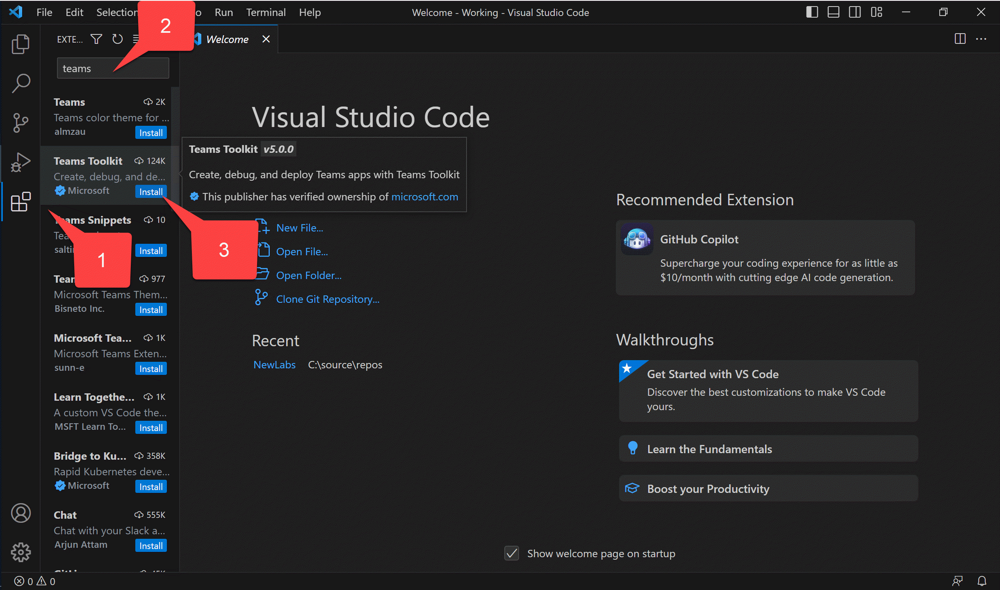

> #### 팀 툴킷을 설치했지만 숨겨놓았다면
> 
> 이전에 팀 툴킷을 설치했는데 비주얼 스튜디오 사이드바에서 숨겨놓았다면, 왜 보이지 않는지 궁금할 수 있습니다. 왼쪽 사이드바를 마우스 오른쪽 버튼으로 클릭하고 팀 툴킷을 체크하면 다시 보이게 할 수 있습니다.
{: .block-tip }

## Exercise 3: Download the starting application

> #### 보통은 이렇게 하지 않을 수도 있습니다
> 
> 새로운 애플리케이션을 만들고자 한다면 Teams Toolkit의 “Create a New App” 기능을 사용하고 싶을 것입니다. 그러나 이 실습이 작성된 이후에 새로운 앱 코드가 변경되었습니다. 실습이 올바르게 작동하도록 하기 위해, 이제 이 지침은 Teams Toolkit에서 새로운 앱을 만드는 대신 시작 코드를 다운로드하라고 안내합니다.
{: .block-tip }

먼저, [app-camp 저장소를](https://github.com/microsoft/app-camp){:target="_blank"}로 이동하여 해당 코드를 복제하거나 다운로드하세요.

그런 다음 [/src/teams-toolkit/Lab01-From-TTK-template](https://github.com/microsoft/app-camp/tree/main/src/teams-toolkit/Lab01-From-TTK-template/NorthwindSuppliers){:target="_blank"} 폴더를 찾아 컴퓨터의 작업 위치에 복사하세요. 

마지막으로 Visual Studio Code를 app-camp-main\src\teams-toolkit\Lab01-From-TTK-template 가 아닌  app-camp-main\src\teams-toolkit\Lab01-From-TTK-template\NorthwindSuppliers를 불러와서 시작하세요. *디렉토리를 열때는 반드시 .vscode 폴더가 보이는 디렉토리까지 이동하여 열어야 합니다.

이제 Teams Toolkit 탭을 열고 Microsoft 365에 로그인되어 있는지 확인하세요. Teams Toolkit은 앱 사이드로딩이 활성화되어 있는지 확인합니다. 활성화되어 있다면 녹색 체크 표시가 표시됩니다. 그렇지 않다면 [Exercise 1 Step 2](../01-create-app/#step-2-enable-teams-application-uploads){:target="_blank"}에서 설명한 대로 애플리케이션 업로드를 활성화하세요.

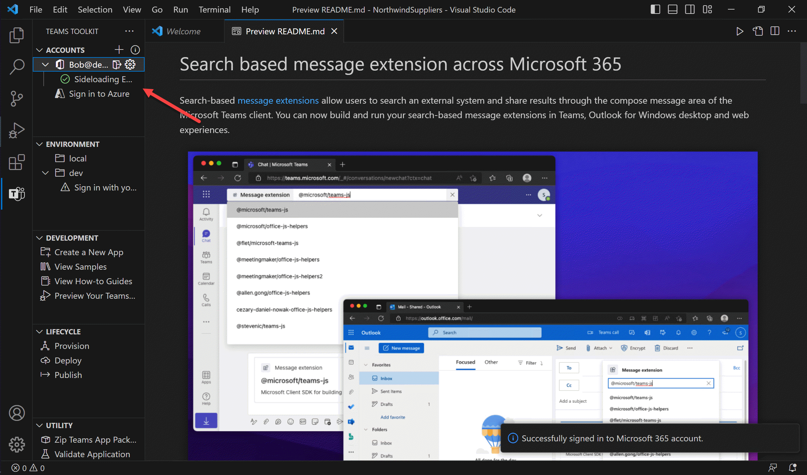

## Exercise 4: Run the application

> 내부 또는 게스트 사용자와 Teams 채팅이 진행 중인지 확인하세요
> 
>새로운 테넌트로 시작하고 Teams 채팅을 한 번도 해본 적이 없다면, 앱을 가장 최근 채팅에 설치하려고 할 때 애플리케이션이 올바르게 시작되지 않을 수 있습니다. 이 문제를 해결하려면 [Microsoft Teams](https://teams.microsoft.com){:target="_blank"}에 로그인하고 왼쪽 사이드바에서 채팅 버블을 클릭하여 누구나 채팅을 시작하세요. 테넌트와 함께 테스트 사용자를 설정했다면 "Megan Bowen"이나 "Adele Vance"와 채팅할 수 있어야 합니다.
>
>또한 ["외부"](https://aka.ms/external-vs-guest-users){:target="_blank"} 사용자는 Teams 앱을 사용할 수 없으므로, 채팅이 Skype for Business 연합만으로 이루어져 있다면 작동하지 않습니다. 초대된 "게스트" 사용자나 개발자 테넌트 내의 사용자를 사용하세요.
{: .block-warning }

이 시점에서 Teams Toolkit은 애플리케이션 코드를 생성했는데, 이 경우 [Restify](http://restify.com/){:target="_blank"}와 [Azure Bot Framework SDK](https://learn.microsoft.com/javascript/api/?view=botbuilder-ts-latest){:target="_blank"}를 사용하는 NodeJS로 실행되는 웹 서비스입니다. 실행하려면 F5 키를 누르거나 디버그 버튼을 클릭하세요.

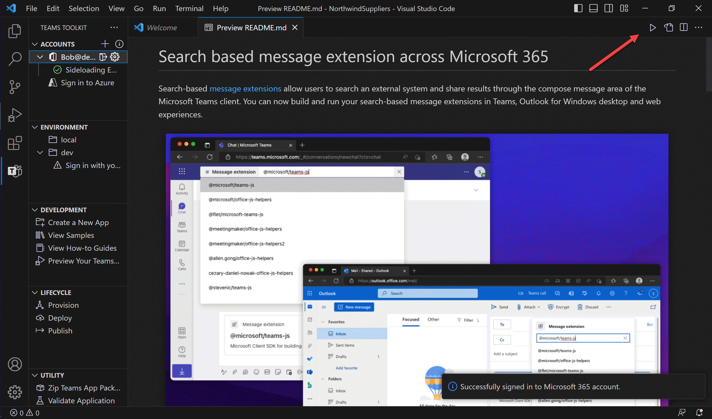

디버그 구성을 선택하라는 메시지가 표시됩니다. "Debug in Teams (Edge)" 또는 "Debug in Teams (Chrome)" (또는 제공되는 경우 다른 브라우저 선택사항)을 선택하세요.

앱이 시작되기를 기다리는 동안 Teams Toolkit이 수행하는 모든 작업들을 생각해보세요. 특히 처음 실행할 때는요.

1. Provision

    팀 메시지 확장은 Azure Bot Framework를 사용하여 팀과 통신합니다. 그래서 새로운 웹 서비스가 Bot SDK를 사용하는 것입니다. 이것은 채팅 메시지, 메시지 확장에서 검색, 적응형 카드에서 버튼을 클릭하는 것과 같은 실시간 상호작용에 최적화된 안전한 채널을 제공합니다. 이 모든 것들은 팀에서 Bot Framework를 사용합니다.

    - Bot Framework를 사용하려면 앱에 Bot 등록이 필요합니다. 팀 툴킷은 [Bot Developer Portal](https://dev.botframework.com/bots){:target="_blank"}에서 봇을 등록합니다. 봇은 Microsoft Azure의 리소스로도 등록할 수 있습니다.

    - 각 봇은 Azure AD 아이덴티티를 가지고 있으며, 팀 툴킷은 이것도 등록합니다. [Azure AD 관리 센터](https://aad.portal.azure.com/){:target="_blank"}에서 등록을 볼 수 있습니다. 봇 ID와 시크릿이라고 자주 언급되는 것은 실제로 이 앱 등록의 응용 프로그램 ID와 시크릿입니다. 봇 코드는 이 정보를 사용하여 들어오는 요청을 검증하고, Azure Bot Channel Service에서 온 것인지 확인합니다.

    - Azure Bot Channel Service에서 오는 HTTP 요청은 어떻게든 웹 서비스에 도달해야 합니다. 보통 이런 종류의 들어오는 요청은 사용자의 방화벽에 의해 차단될 것입니다. 로컬 디버깅을 가능하게 하기 위해, 팀 툴킷은 새로운 Visual Studio Code [dev tunnels](https://devblogs.microsoft.com/microsoft365dev/teams-toolkit-for-visual-studio-code-update-april-2023/){:target="_blank"}을 사용하여 터널을 설정합니다. 팀 툴킷은 팀이 앱과 통신할 수 있도록 이 터널의 URL을 봇 등록에 업데이트합니다."

2. Deploy

    - Teams Toolkit은 Teams에 업로드하기 전에 매니페스트 스키마에 맞고 아이콘 파일이 가이드라인을 준수하는지 확인하기 위해 애플리케이션 패키지에 대한 로컬 검증을 수행합니다.

    - Teams Toolkit은 애플리케이션이 사용하는 모든 npm 패키지를 설치합니다. 처음에는 시간이 오래 걸릴 수 있습니다.

    - Teams Toolkit은 애플리케이션을 실행하고 디버거를 Visual Studio Code에 연결합니다.

3. Publish

    - Teams Toolkit은 [Teams 앱 매니페스트](https://learn.microsoft.com/microsoftteams/platform/resources/schema/manifest-schema){:target="_blank"}를 생성합니다. 이는 Teams가 앱을 표시하고 상호 작용하는 데 필요한 모든 정보를 포함하는 JSON 파일입니다. 그런 다음 매니페스트와 두 개의 애플리케이션 아이콘을 포함하는 .zip 압축 파일인 Teams 앱 패키지를 생성합니다.

    - Teams Toolkit은 패키지를 Microsoft Teams에 업로드하고 Teams에서 앱을 설치하는 데 깊이 연결된 웹 브라우저를 엽니다.

그리고 마지막으로 브라우저가 열려서 애플리케이션을 테스트할 수 있습니다. Microsoft 365 테넌트에 로그인하라는 메시지가 나타날 수 있고, 방화벽을 통해 NodeJS 웹 서버에 접근할 수 있도록 허용해야 할 수도 있습니다.

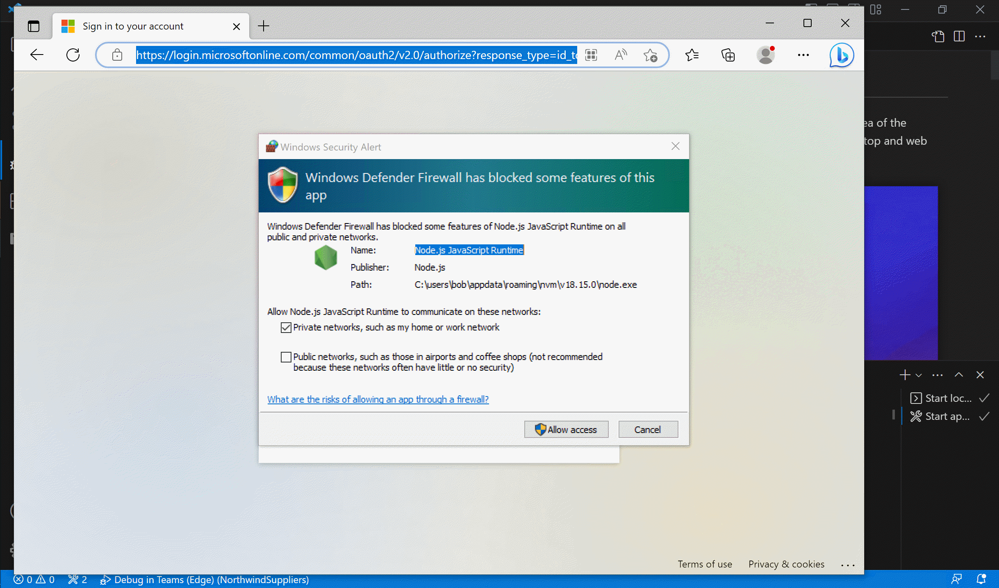

결국 딥 링크가 Microsoft Teams에서 애플리케이션의 설치 화면을 보여줍니다. 앱을 설치하려면 “추가” 버튼을 클릭하세요.

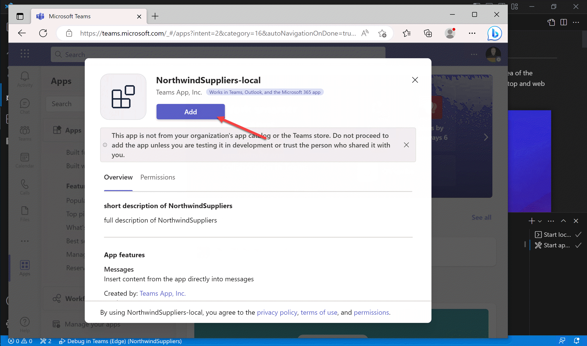

Teams는 대화를 열고 새로운 메시지 확장을 엽니다. 이것은 사용자가 일반적으로 메시지 작성 창 아래에서 접근할 수 있는 팝업이지만, 여기서 Teams는 메시지 확장을 자동으로 엽니다.

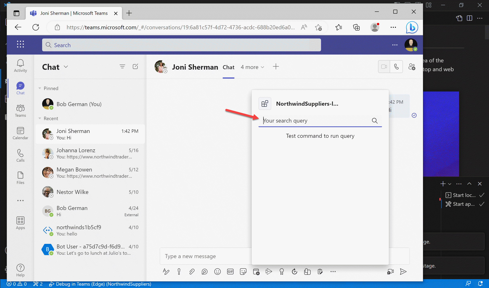

앱이 처음 열릴 때 다시 로그인하라는 메시지가 나타날 수도 있습니다.

"Your search query"라고 표시된 텍스트 상자를 클릭하고 "teamsfx"와 같은 검색어를 입력하세요. 이 시작 메시지 확장은 실제로 npm 패키지 목록을 검색하므로, 이름에 “teamsfx"가 포함된 여러 패키지를 볼 수 있습니다.

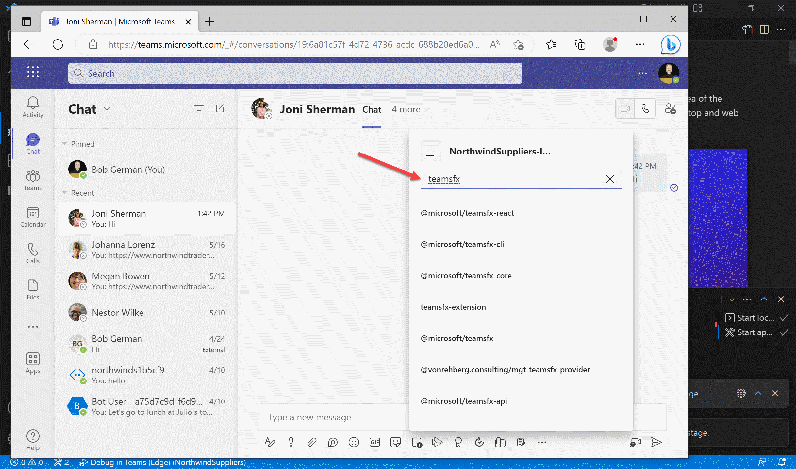

패키지 이름 중 하나를 선택하면 Teams가 해당 패키지에 대한 정보를 담은 메시지 카드를 대화창에 삽입합니다.

1️⃣ 카드와 함께 자신의 메시지를 입력할 수도 있습니다.

2️⃣ 보내기를 클릭하면 대화 상대와 카드를 공유할 수 있습니다.

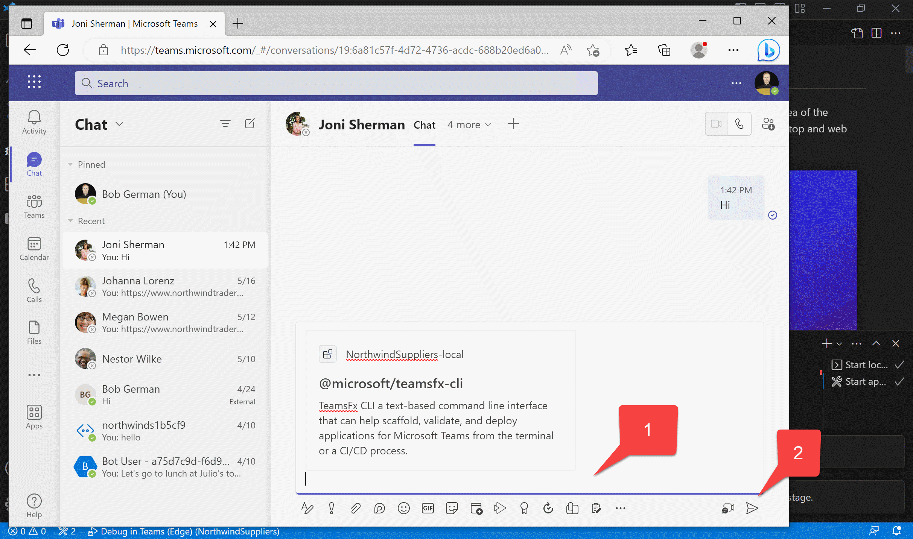

Teams와 웹 서비스를 연동하여 사용자가 정보를 검색하고 동료와 공유할 수 있게 하였습니다

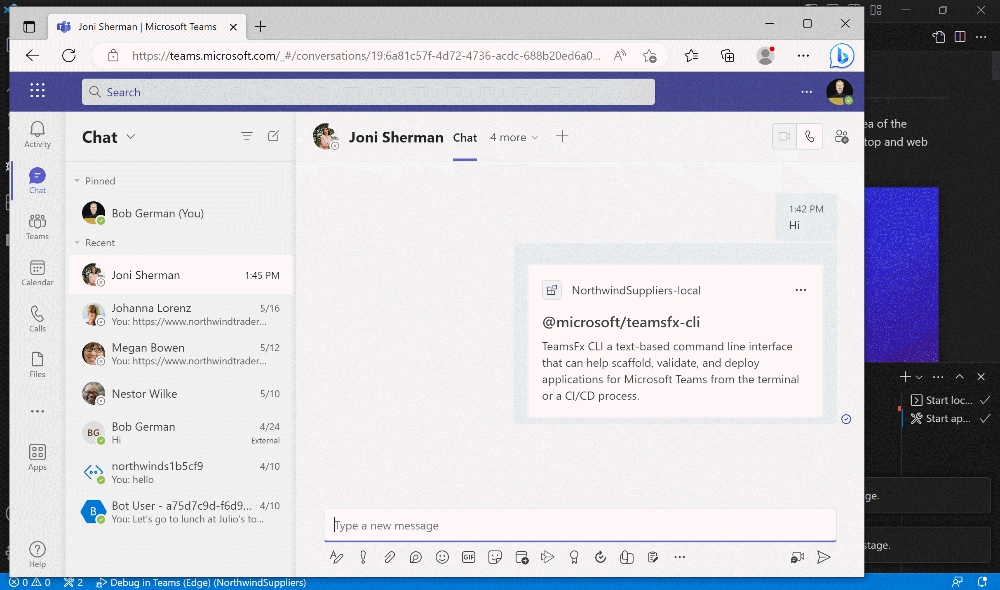

> #### 팀스 툴킷으로 앱을 시작할 수 있는 방법은 최소 5가지가 있습니다 - 모두 찾아볼 수 있나요?
> 
> 앱을 시작할 수 있는 방법은 다양합니다 - 가장 쉬운 방법을 선택하세요!
>
> - VS Code의 어떤 탭에서든지, 실행 메뉴 1️⃣를 사용하거나, 툴바 버튼 2️⃣을 클릭하거나, 키보드에서 F5를 누르세요.
>
> 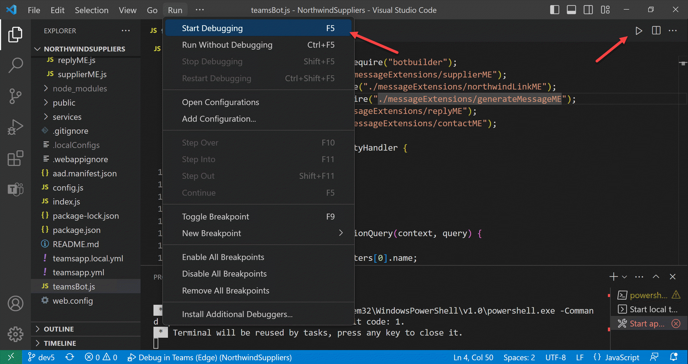
>
> - "Debug" 탭에서는, 디버그 도구로 앱을 시작할 수 있습니다. 이 도구는 버튼의 오른쪽에 있는 드롭다운에서 디버거 설정을 미리 선택할 수 있게 해줍니다.
>
> 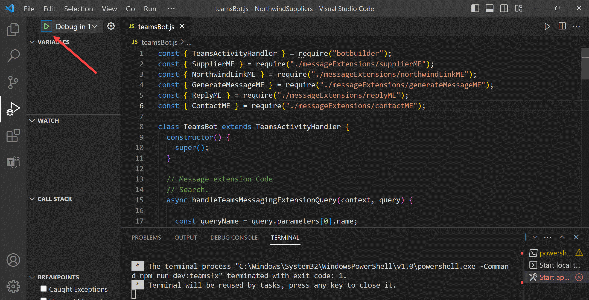
>
> - 팀스 툴킷 탭에서는, 환경의 오른쪽에 나타나는 버튼으로 앱을 시작할 수 있습니다. 로컬 디버깅을 위해서는 환경이 "local"로 되어 있어야 합니다.
>
> 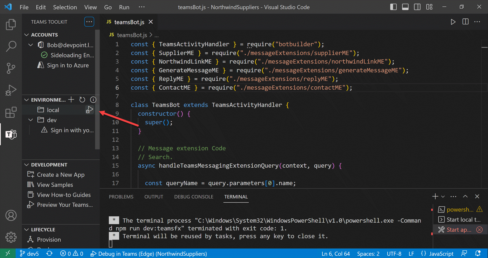
{: .block-tip }

## What's next?

다음 실습에 들어가기 전에 디버그 모드를 종료해 주세요. 디버그 모드를 종료하려면 디버그 브라우저 창을 닫거나 Visual Studio Code 툴바에서 연결 해제 버튼을 누르면 됩니다. 다음 실습은 애플리케이션을 완전히 다시 시작해야 하기 때문입니다.

[다음 실습](../02-integrate-web-service/)에서는 애플리케이션에 브랜드를 적용하고 Northwind 공급업체에 관한 정보를 검색하도록 업데이트합니다. 또한 지루한 메시지 카드([Hero Card](https://learn.microsoft.com/microsoftteams/platform/task-modules-and-cards/cards/cards-reference#hero-card){:target="_blank"})를 훨씬 재미있는 [Adaptive Card](https://adaptivecards.io/){:target="_blank"}로 교체합니다.

## Known issues

이 저장소에 대한 최신 문제나 버그 리포트를 보려면 [GitHub issues](https://github.com/microsoft/app-camp/issues){:target="_blank"} 목록을 참고하세요.
