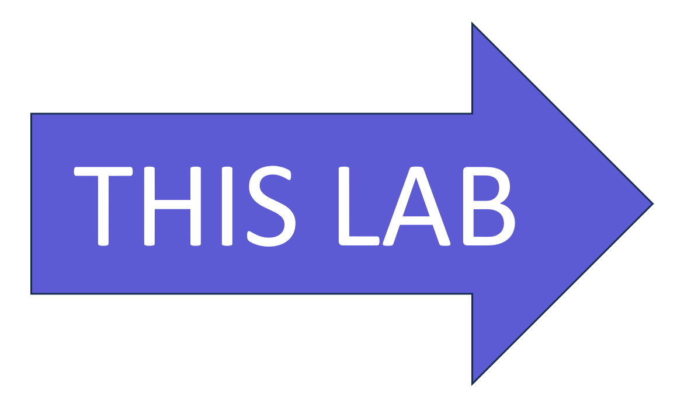

# Lab 2: Integrate business data with your app

> #### 실습 계획 
> 
> * [**Lab 1 - Create your first app with Teams Toolkit**](./2024-01-02-1.create-app.html) 이 랩에서는 Teams Toolkit을 설정하고 Teams 메시지 확장을 만드는 방법을 알아보겠습니다.
> *  [**Lab 2 - Integrate business data with your application**](./2024-01-03-2.integrate-web-service.html) 이 실습에서는 새로운 앱을 'Northwind Suppliers’라고 브랜딩하고, Microsoft Teams 대화에서 Northwind Traders 샘플 데이터베이스의 데이터를 삽입할 수 있는 기능을 제공합니다. 또한 메시지 확장을 사용하여 어댑티브 카드를 생성하고 전송하는 방법을 배우게 됩니다.
> * [**Lab 3 - Add link unfurling**](./2024-01-04-3.add-link-unfurling.html) 이 랩에서는 사용자가 대화에 URL을 포함할 때 사용자 정의 요약을 제공하는 링크 언퍼링 기능을 사용하는 방법을 배우게 됩니다.
> * [**Lab 4 - Action message extensions with Open AI**](./2024-01-05-4.add-ai.html) 이 랩에서는 “액션” 메시지 확장 기능을 만드는 방법을 배울 수 있습니다. 이 기능은 직접 실행하거나 다른 팀 메시지의 컨텍스트 메뉴에서 실행하여 해당 메시지에 대한 작업을 수행할 수 있습니다. 이 랩에서는 Open AI 상업 웹 서비스(Azure 또는 Open AI 계정을 사용하여)를 이용하여 메시지를 생성합니다.
> * [**Lab 5 - Single Sign-on and Microsoft Graph**](./2024-01-06-5.add-sso.html) 이 실습에서는 Azure AD Single Sign-On을 사용하여 사용자를 인증하고 Microsoft Graph API를 호출하는 방법을 배웁니다. 이와 같은 과정은 로그인한 사용자를 대신하여 Azure AD로 보호되는 웹 서비스를 호출할 때 사용됩니다.
> * [**Lab 6 - Run the app in Outlook**](./2024-01-07-6.run-in-outlook.html) 이 랩에서는 Microsoft Outlook에서 Northwind Suppliers 애플리케이션을 실행합니다.
{: .block-tip }

이전 실습에서는 Teams Toolkit for Visual Studio Code를 사용하여 검색 메시지 확장을 만들고 실행해 보았습니다. 이것은 npm 패키지를 검색하는 상당히 일반적인 메시지 확장입니다. 이번 실습에서는 애플리케이션에 브랜딩을 적용하고, 엔터프라이즈 웹 서비스를 호출하고, 간단한 히어로 카드 대신에 적응형 카드를 보내는 방법을 배워보겠습니다.

## Features

- 앱은 Northwind Suppliers라는 이름과 적절한 앱 로고로 나열됩니다.
- 앱은 Northwind Suppliers 데이터베이스를 쿼리하고 이름으로 공급업체를 검색할 수 있습니다.
- Supplier를 선택하면 앱은 대화에 적응형 카드를 삽입합니다.

## Exercise 1: Update the App Manifest

### Step 1: Download new app icons and place them in the **appPackage** folder.

 * 큰 아이콘은 컬러로 하고 192x192 픽셀이어야 합니다:
   [northwind-suppliers-192.png](../assets/new-adventure/northwind-suppliers-192.png){:target="_blank"} 

    

 * 작은 아이콘은 흑백으로 하고 32x32 픽셀이어야 합니다:
   [northwind-suppliers-32.png](../assets/new-adventure/northwind-suppliers-32.png){:target="_blank"}

    

### Step 2: Update the **manifest.json** file

프로젝트 디버깅을 중지하려면 브라우저를 닫으세요. 그런 다음 Visual Studio Code에서 **appPackage** 폴더에 있는 Teams 매니페스트 템플릿, **manifest.json**을 엽니다. 아이콘 파일 이름을 새 파일 이름으로 바꾸세요.

```js
"icons": {
    "color": "northwind-suppliers-192.png",
    "outline": "northwind-suppliers-32.png"
},
```

아래로 스크롤하고 매니페스트의 이름과 설명 필드를 업데이트하세요. 이것들은 사용자가 팀에서 애플리케이션을 볼 때 보여집니다. 토큰 ${{TEAMSFX_ENV}}는 팀 툴킷의 현재 개발 환경을 나타내기 위해 확장됩니다. 현재는 "LOCAL"입니다. 나중에 원한다면 "DEV", "STAGING" 등과 같은 추가 환경을 만들 수 있습니다.

```js
"name": {
    "short": "Northwind Suppliers-${{TEAMSFX_ENV}}",
    "full": "Northwind Suppliers - Teams App Camp New Adventure"
},
"description": {
    "short": "Access and share Northwind data in Microsoft Teams",
    "full": "Sample application from Teams App Camp, New Adventure"
},
```

거기서 강조 색상을 큰 아이콘과 같은 색조의 연한 파란색으로 바꿔주세요:

```js
"accentColor": "#9EDBF9",
```

계속해서 아래로 스크롤하면, `composeExtensions:`  `commands:` 아래에 메시지 확장 명령의 제목과 설명을 편집할 수 있습니다. 이 설정은 검색 상자가 사용자에게 어떻게 표시되는지를 제어합니다.

```js
    "commands": [
        {
            "id": "searchQuery",
            "context": [
                "compose",
                "commandBox"
            ],
            "description": "Look up a Northwind supplier",
            "title": "Supplier search",
            "type": "query",
            "parameters": [
                {
                    "name": "searchQuery",
                    "title": "Supplier search",
                    "description": "Look up a Northwind supplier",
                    "inputType": "text"
                }
            ]
        }
    ]
```

이제 애플리케이션을 다시 시작해보세요 - 사실, 실행 중이라면 멈추고 다시 시작해야 Teams Toolkit이 업데이트된 앱 매니페스트를 빌드합니다. 이제는 훨씬 더 "Northwindy"하게 보일 것입니다. 하지만 물론 여전히 npm 데이터를 쿼리하는 것뿐입니다.


## Exercise 2: Add new Message Extension code

이번 실습과 이어지는 실습에서는 Northwind Suppliers 애플리케이션에 여러 가지 다른 메시지 확장 기능을 추가할 것입니다. 그래서 각 메시지 확장 기능의 코드를 [teamsBot.js]() 파일에 인라인으로 넣는 대신 별도의 모듈에 넣을 것입니다.

### Step 1: Add Message Extension logic

먼저, **NorthwindSuppliers** 디렉토리에 **messageExtensions**라는 폴더를 만듭니다. 그 다음 **messageExtensions** 폴더에 **supplierME.js**라는 새 파일을 만들고 다음 코드를 복사해 붙여넣습니다:

```js
const axios = require("axios");
const ACData = require("adaptivecards-templating");
const { CardFactory } = require("botbuilder");

class SupplierME {

    // Get suppliers given a query
    async handleTeamsMessagingExtensionQuery (context, query) {

        try {
            const response = await axios.get(
                `https://services.odata.org/V4/Northwind/Northwind.svc/Suppliers` +
                `?$filter=contains(tolower(CompanyName),tolower('${query}'))` +
                `&$orderby=CompanyName&$top=8`
            );

            const attachments = [];
            response.data.value.forEach((supplier) => {

                // Free flag images from https://flagpedia.net/
                const flagUrl = this.#getFlagUrl(supplier.Country);
                const imageUrl = `https://picsum.photos/seed/${supplier.SupplierID}/300`;

                const itemAttachment = CardFactory.heroCard(supplier.CompanyName);
                const previewAttachment = CardFactory.thumbnailCard(supplier.CompanyName,
                    `${supplier.City}, ${supplier.Country}`, [flagUrl]);

                previewAttachment.content.tap = {
                    type: "invoke",
                    value: {    // Values passed to selectItem when an item is selected
                        queryType: 'supplierME',
                        SupplierID: supplier.SupplierID,
                        flagUrl: flagUrl,
                        imageUrl: imageUrl,
                        Address: supplier.Address || "",
                        City: supplier.City || "",
                        CompanyName: supplier.CompanyName || "unknown",
                        ContactName: supplier.ContactName || "",
                        ContactTitle: supplier.ContactTitle || "",
                        Country: supplier.Country || "",
                        Fax: supplier.Fax || "",
                        Phone: supplier.Phone || "",
                        PostalCode: supplier.PostalCode || "",
                        Region: supplier.Region || ""
                    },
                };
                const attachment = { ...itemAttachment, preview: previewAttachment };
                attachments.push(attachment);
            });

            return {
                composeExtension: {
                    type: "result",
                    attachmentLayout: "list",
                    attachments: attachments,
                }
            };

        } catch (error) {
            console.log(error);
        }
    };

    handleTeamsMessagingExtensionSelectItem (context, selectedValue) {

        // Read card from JSON file
        const templateJson = require('../cards/supplierCard.json');
        const template = new ACData.Template(templateJson);
        const card = template.expand({
            $root: selectedValue
        });

        const resultCard = CardFactory.adaptiveCard(card);

        return {
            composeExtension: {
                type: "result",
                attachmentLayout: "list",
                attachments: [resultCard]
            },
        };

    };

    // Get a flag image URL given a country name
    // Thanks to https://flagpedia.net for providing flag images
    #getFlagUrl (country) {

        const COUNTRY_CODES = {
            "australia": "au",
            "brazil": "br",
            "canada": "ca",
            "denmark": "dk",
            "france": "fr",
            "germany": "de",
            "finland": "fi",
            "italy": "it",
            "japan": "jp",
            "netherlands": "nl",
            "norway": "no",
            "singapore": "sg",
            "spain": "es",
            "sweden": "se",
            "uk": "gb",
            "usa": "us"
        };

        return `https://flagcdn.com/32x24/${COUNTRY_CODES[country.toLowerCase()]}.png`;

    };
}

module.exports.SupplierME = new SupplierME();
```

> #### 코드 설명
>
> 방금 복사한 코드의 핵심 요약은 다음과 같습니다:
>
> * **`handleTeamsMessagingExtensionQuery (context, query)`** - 이 함수는 메시지 확장의 검색 상자에 사용자가 무언가를 입력하면 실행됩니다. 즉, 부분적인 쿼리를 받을 수 있습니다. 또한 매니페스트의 [`initialRun` 파라미터](https://learn.microsoft.com/en-us/microsoftteams/platform/resources/schema/manifest-schema#composeextensionscommands){:target="_blank"}를 사용하여 사용자가 메시지 확장을 열자마자 빈 쿼리로 메시지 확장을 호출하도록 팀에게 알릴 수도 있습니다.
>
> 이 함수는 공개 웹 서비스를 호출하는 것에 주목하세요. 이 웹 서비스는 [OData 팀](https://www.odata.org/){:target="_blank"}이 호스팅하는 샘플 [OData 데이터베이스](https://www.odata.org/odata-services/#3){:target="_blank"}이고, 사용자의 쿼리를 포함하는 공급자를 선택하기 위해 [OData 필터](https://www.odata.org/getting-started/basic-tutorial/#queryData){:target="_blank"}를 포함하고 있습니다. OData는 Microsoft 365과 Microsoft Teams의 서버 측 API인 [Microsoft Graph](https://developer.microsoft.com/graph){:target="_blank"}에서 사용되기 때문에 배우는 것이 좋습니다.
>
> 이 함수는 [첨부 파일](https://learn.microsoft.com/azure/bot-service/bot-builder-howto-add-media-attachments?view=azure-bot-service-4.0&tabs=javascript){:target="_blank"}의 배열을 반환합니다. 이 첨부 파일들은 각각 `itemAttachment` (사용자가 항목을 선택하면 기본적으로 표시됨), 검색 결과 목록에 표시되는 `previewAttachment`, 그리고 검색 결과에서 항목을 선택할 때 `handleTeamsMessagingExtensionSelectItem`에 전달되는 `value`를 포함합니다.
>
> * **`handleTeamsMessagingExtensionSelectItem (context, selectedValue)`** - 이 함수는 사용자가 검색 결과에서 항목을 클릭할 때 호출됩니다. 이전 함수에서 해당 항목의 `value`가 전달되므로, 우리가 적응형 카드를 만드는 데 필요한 데이터를 스스로 줄 수 있습니다.
>
>   The code binds this value to the adaptive card template with this code:
>   ```js
>   const templateJson = require('./supplierCard.json');
>   const template = new ACData.Template(templateJson);
>   const card = template.expand({
>       $root: selectedValue
>   });
>   ```        
>   The function returns the adaptive card for insertion in the compose box in Microsoft Teams.
>
> * **`#getFlagUrl (country)`** - 그림이 없어서 카드가 재미없었는데, 이 비공개 함수는 각 공급업체의 국가에 따라 국기 이미지를 찾아줍니다. 국기 모음집을 제공해준 [https://flagpedia.net](https://flagpedia.net){:target="_blank"}에 감사드립니다!
{: .block-tip }

### Step 2: Add the adaptive card file

새로운 메시지 확장은 공급업체 데이터를 표시하기 위해 어댑티브 카드를 사용할 것입니다. 어댑티브 카드는 표시할 카드를 정의하는 JSON 구조체입니다. 우리는 JSON을 별도의 파일에 저장하고 런타임에 데이터를 주입할 수 있도록 [adaptive card templating](https://learn.microsoft.com/en-us/adaptive-cards/templating/){:target="_blank"}을 사용할 것입니다.

먼저 **NorthwindSuppliers** 폴더 아래에 새로운 폴더 **cards**를 만듭니다. 그리고 **cards** 폴더에 **supplierCard.json** 파일을 만들고 다음의 JSON을 붙여넣습니다:

```json
{
    "type": "AdaptiveCard",
    "$schema": "http://adaptivecards.io/schemas/adaptive-card.json",
    "version": "1.4",
    "body": [
        {
            "type": "ColumnSet",
            "columns": [
                {
                    "type": "Column",
                    "width": "50px",
                    "verticalContentAlignment": "center",
                    "items": [
                        {
                            "type": "Container",
                            "items": [
                                {
                                    "type": "Image",
                                    "horizontalAlignment": "center",
                                    "url": "${flagUrl}",
                                    "altText": "${Country} flag"
                                }
                            ]
                        }
                    ]
                },
                {
                    "type": "Column",
                    "items": [
                        {
                            "type": "Container",
                            "items": [
                                {
                                    "type": "TextBlock",
                                    "size": "extraLarge",
                                    "weight": "lighter",
                                    "text": "${CompanyName}",
                                    "wrap": true
                                }
                            ],
                            "bleed": true
                        }
                    ]
                }
            ]
        },
        {
            "type": "ColumnSet",
            "columns": [
                {
                    "type": "Column",
                    "items": [
                        {
                            "type": "Container",
                            "spacing": "none",
                            "style": "emphasis",
                            "items": [
                                {
                                    "type": "TextBlock",
                                    "spacing": "small",
                                    "text": "${Address}",
                                    "wrap": true
                                },
                                {
                                    "type": "TextBlock",
                                    "spacing": "none",
                                    "text": "${City} ${Region} ${PostalCode} ${Country}",
                                    "wrap": true
                                },
                                {
                                    "type": "TextBlock",
                                    "spacing": "none",
                                    "text": "${Phone}",
                                    "wrap": true
                                },
                                {
                                    "type": "TextBlock",
                                    "spacing": "large",
                                    "text": "Contact:",
                                    "wrap": true
                                },
                                {
                                    "type": "TextBlock",
                                    "spacing": "none",
                                    "text": "${ContactName}",
                                    "wrap": true
                                },
                                {
                                    "type": "TextBlock",
                                    "spacing": "none",
                                    "text": "${ContactTitle}",
                                    "wrap": true
                                }
                            ],
                            "bleed": true,
                            "height": "stretch"
                        }
                    ],
                    "width": 45
                },
                {
                    "type": "Column",
                    "items": [
                        {
                            "type": "Container",
                            "height": "stretch",
                            "items": [
                                {
                                    "type": "ColumnSet",
                                    "columns": [
                                        {
                                            "type": "Column",
                                            "verticalContentAlignment": "center",
                                            "items": [
                                                {
                                                    "type": "Image",
                                                    "url": "${imageUrl}"
                                                }
                                            ],
                                            "width": "stretch"
                                        }
                                    ]
                                },
                                {
                                    "type": "ActionSet",
                                    "separator": true,
                                    "actions": [
                                        {
                                            "type": "Action.OpenUrl",
                                            "title": "Web site",
                                            "url": "https://adaptivecards.io"
                                        }
                                    ],
                                    "spacing": "medium"
                                }
                            ]
                        }
                    ],
                    "width": 55
                }
            ],
            "height": "stretch"
        }
    ]
}
```

> #### 코드 설명
>
> 어댑티브 카드에 대해 알고 싶다면 [https://adaptivecards.io](https://adaptivecards.io){:target="_blank"}를 방문하세요. 다양한 샘플과 [adaptive card designer](https://adaptivecards.io/designer/){:target="_blank"}가 있습니다. 이 랩에서 사용한 카드는 이 디자이너를 이용하여 만들었습니다.
>
>JSON에는 [Adaptive Cards Template Language](https://learn.microsoft.com/adaptive-cards/templating/language){:target="_blank"}를 사용한 데이터 바인딩 표현식이 포함되어 있습니다. 예를 들어, `${flagUrl}` 표현식은 메시지 확장 코드에서 `selectedValue.flagUrl`의 값을 삽입합니다.
{: .block-tip }

### Step 3: Install the adaptivecards-templating npm package

어댑티브 카드 템플릿 라이브러리 없이는 템플릿 작업이 안 되니까, **NorthwindSuppliers** 폴더 안에서 이 명령어를 실행해서 설치합니다.

```shell
npm install adaptivecards-templating
```

> #### 비주얼 스튜디오 코드에서 명령 줄을 열기 쉬운 방법
>
>비주얼 스튜디오 코드에서 터미널 창을 이미 팀스 툴킷이 사용하고 있어도 명령 줄을 바로 열 수 있습니다. Visual studio code 상단의 터미널 메뉴로 가서 "새 터미널"을 선택하거나, 윈도우에서는 " ctrl+shift+' "을 입력하면 됩니다. 터미널 창 오른쪽에 작은 탭이 있어서 어떤 터미널을 보고 있는지 선택할 수 있다는 것에 주의하세요 - 팀스 툴킷은 때때로 여러 개의 터미널을 실행하기도 합니다!
{: .block-tip }

## Step 4: Update the Teams Bot

메시지 확장은 Azure Bot Framework를 사용하여 Microsoft Teams와 통신하는 웹 서비스라는 것을 기억하세요. 그래서 물론, 봇이 있습니다; Teams Toolkit은 **teamsBot.js**라는 적절한 이름의 파일에 봇 코드를 생성했습니다.

이 단계에서는 npm 라이브러리에 대한 호출을 제거하고 대신 방금 추가한 메시지 확장 코드를 호출하겠습니다. 이후에 따라올 실습에서 더 많은 메시지 확장을 추가하기 쉽도록 몇 가지 switch 문을 설정하겠습니다.

**teamsBot.js**를 편집하고 상단의 `require` 문을 다음과 같이 바꾸세요:

```js
const { TeamsActivityHandler } = require("botbuilder");
const { SupplierME } = require("./messageExtensions/supplierME");
```

이렇게 하면 supplierME 메시지 확장에 대한 참조를 얻을 수 있고, supplierME 코드에서 처리되고 있는 axios와 카드 팩토리의 요구사항을 제거할 수 있습니다.

다음으로, `handleTeamsMessagingExtensionQuery()` 함수를 이렇게 더 짧은 버전으로 바꿉니다:

```js
  async handleTeamsMessagingExtensionQuery(context, query) {

    const queryName = query.parameters[0].name;
    const searchQuery = query.parameters[0].value;

    switch (queryName) {
      case "searchQuery":  // Search for suppliers
        return await SupplierME.handleTeamsMessagingExtensionQuery(context, searchQuery);
      default:
        return null;
    }
  }
```

switch 문은 `queryName`이 "searchQuery"인지 확인하여 요청이 우리의 새로운 SupplierME 메시지 확장을 위한 것임을 알 수 있습니다. 이는 Exercise 1 Step 2에서 이 메시지 확장 명령에 `searchQuery` 파라미터가 지정되었기 때문입니다.


마지막으로, `handleTeamsMessagingExtensionSelectItem()`을 다음 버전으로 교체하십시오. 이 버전은 SelectItem 이벤트를 우리의 메시지 확장에 전달할 것입니다.

```js
  async handleTeamsMessagingExtensionSelectItem(context, item) {

    switch (item.queryType) {
      case "supplierME":  // Search for suppliers
        return SupplierME.handleTeamsMessagingExtensionSelectItem(context, item);
      default:
        return null;
    }

  }
```

수정된 전체 코드는 다음과 같습니다
```js
const { TeamsActivityHandler } = require("botbuilder");
const { SupplierME } = require("./messageExtensions/supplierME");

class TeamsBot extends TeamsActivityHandler {
  constructor() {
    super();
  }

  // Message extension Code
  // Search.
  async handleTeamsMessagingExtensionQuery(context, query) {

    const queryName = query.parameters[0].name;
    const searchQuery = query.parameters[0].value;

    switch (queryName) {
      case "searchQuery":  // Search for suppliers
        return await SupplierME.handleTeamsMessagingExtensionQuery(context, searchQuery);
      default:
        return null;
    }
  }

  async handleTeamsMessagingExtensionSelectItem(context, item) {

    switch (item.queryType) {
      case "supplierME":  // Search for suppliers
        return SupplierME.handleTeamsMessagingExtensionSelectItem(context, item);
      default:
        return null;
    }

  }
}

module.exports.TeamsBot = TeamsBot;
```


## Exercise 3: Run the app

앱을 다시 실행하고 메시지 확장을 테스트할 시간입니다.

1️⃣ 처음 실행한 후에는 작성 상자에서 "…"을 클릭하여 설치된 대화에서 앱에 액세스할 수 있습니다. 

2️⃣ 검색 상자를 열려면 애플리케이션을 선택합니다.


1️⃣ 검색어를 입력하면 국기와 함께 Northwind 공급업체 목록이 표시됩니다.

2️⃣ 대화에 적응형 카드를 삽입하려면 국기를 선택합니다.


이 시점에서는 적응형 카드와 함께 추가 정보를 추가하려면 메시지를 편집할 수 있습니다.


카드는 대화에 남아 정보를 제공하고 조치를 취할 수 있는 기능을 제공합니다.


> #### Challenge
>
> 다음은 스스로 시도해볼 수 있는 것입니다! 여기에는 [message extension lab](../aad/MessagingExtension.md){:target="_blank"}이 있습니다. 이 랩은 백엔드 데이터를 업데이트할 수 있는 카드를 생성하므로, 사용자가 적응형 카드에서 직접 작업을 수행할 수 있습니다. 이 랩은 Teams Toolkit 없이 작성되었지만, 코드는 거의 비슷할 것입니다.
>    
> Northwind Suppliers 앱에 데이터를 되돌려 보내는 기능을 추가하는 방법을 알아내보세요. 그러려면 다음과 같은 작업이 필요합니다:
>
> * 적응형 카드를 업데이트하여 하나 이상의 입력 컨트롤과 제출 버튼을 포함시킵니다.
> * 카드가 제출될 때 실행될 코드를 **TeamsBot.js**에 추가합니다 (힌트: ActivityHandler 메서드의 또 다른 오버라이드입니다)
>    
>  Teams 매니페스트를 변경할 필요는 없을 것입니다. 하지만 실제 데이터베이스가 없기 때문에 데이터를 쓸 곳을 찾는 데 어려움을 겪을 수도 있습니다. 하지만 여전히 실험해보는 것이 가치가 있습니다!
{: .block-tip }

## Exercise 4 (Optional): Add Stage View

추가한 적응형 카드에는 [Adaptive Cards 웹 사이트](https://adaptivecards.io){:target="_blank"}를 웹 브라우저에서 볼 수 있는 “보기” 버튼이 있습니다. 이 버튼은 “OpenUrl” 액션을 사용하여 웹 페이지를 엽니다.

이것은 합리적인 방법이지만, 사용자를 Microsoft Teams와 그 안에서 실행되는 애플리케이션에서 멀어지게 만듭니다! 간단한 해결책은 웹 사이트를 [stage view](https://learn.microsoft.com/microsoftteams/platform/tabs/tabs-link-unfurling#invoke-stage-view-from-adaptive-card){:target="_blank"}에서 표시하는 것입니다.

이 선택적인 연습에서는 같은 웹 사이트를 스테이지 뷰에서 표시하는 또 다른 버튼을 카드에 추가할 것입니다.

### Step 1: Update the adaptive card

이전에 이 실습에서 추가한 **cards/supplierCard.json** 파일을 엽니다. `"type": "ActionSet"` 요소로 스크롤하고 `"type": "Action.OpenUrl"` 액션 앞에 `"actions"` 배열에 다른 액션을 추가합니다.

```js
    {
    	"type": "Action.Submit",
    	"title": "Stage view",
    	"data": {
    		"msteams": {
    			"type": "invoke",
    			"value": {
    				"type": "tab/tabInfoAction",
    				"tabInfo": {
    					"contentUrl": "https://adaptivecards.io",
    					"websiteUrl": "https://adaptivecards.io",
    					"name": "WebView",
    					"entityId": "entityId"
    				}
    			}
    		}
    	}
    },
```

수정된 전체 코드는 다음과 같습니다.

```json
{
    "type": "ActionSet",
    "separator": true,
    "actions": [
        {
            "type": "Action.Submit",
            "title": "Stage view",
            "data": {
                "msteams": {
                    "type": "invoke",
                    "value": {
                        "type": "tab/tabInfoAction",
                        "tabInfo": {
                            "contentUrl": "https://adaptivecards.io",
                            "websiteUrl": "https://adaptivecards.io",
                            "name": "WebView",
                            "entityId": "entityId"
                        }
                    }
                }
            }
        },
    
        {
            "type": "Action.OpenUrl",
            "title": "Web site",
            "url": "https://adaptivecards.io"
        }
    ],
    "spacing": "medium"
}
```

### Step 2: Add to the valid domains in the app manifest

방금 추가한 작업은 추가적인 코드가 필요하지 않지만, Teams 앱 매니페스트에 `"contentUrl"`이 포함되어 있지 않으면 실패할 것입니다. 이것은 보안 기능입니다 - 앱 개발자로서, 앱에 유효한 웹 서버를 결정하고, Teams는 다른 서버를 차단합니다.

이를 추가하려면, **appPackage/manifest.json** 파일을 엽니다. 아래로 스크롤하여 `"validDomains"` 객체를 찾고, Teams에서 웹 페이지를 표시할 수 있도록 `"adaptivecards.io"`를 추가합니다.

~~~js
"validDomains": [
    "adaptivecards.io"
],
~~~

### Step 3: Run the app

Teams Toolkit에서 애플리케이션을 중지하고 다시 시작하면 앱 매니페스트가 업데이트됩니다. 앱을 실행하면 각 어댑티브 카드에 "Stage View"라는 두 번째 버튼이 표시됩니다.


이 버튼을 클릭하면 Teams에서 어댑티브 카드 웹 사이트가 팝업 창으로 나타납니다.


대상 웹 사이트에 IFrame에서 실행을 금지하는 코드가 포함되어 있으면 이 기능이 작동하지 않습니다. Teams는 이러한 페이지를 IFrame에서 렌더링하기 때문에 대상 웹 사이트를 변경해야 합니다. 이런 웹 사이트는 `window.ref`를 확인할 수 있습니다."

## Next steps

<a href="./2024-01-04-3.add-link-unfurling.html">

</a>

이 랩을 완료한 후에는 이 학습 경로의 다음 랩인 [Lab 3 - Add link unfurling](./2024-01-04-3.add-link-unfurling.html)로 계속 진행할 수 있습니다.

## Known issues

최신 문제나 버그 리포트를 보려면 이 저장소의 [GitHub issues](https://github.com/microsoft/app-camp/issues){:target="_blank"} 목록을 참조하세요.
