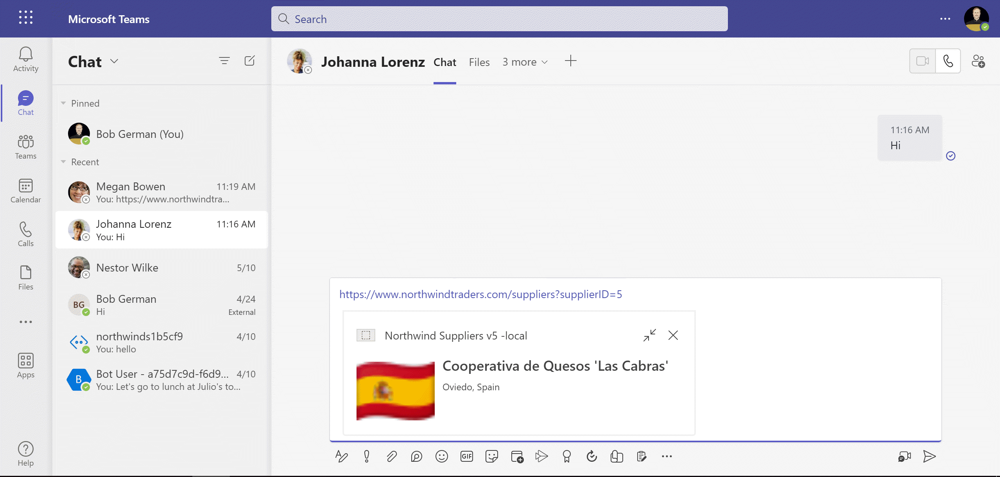
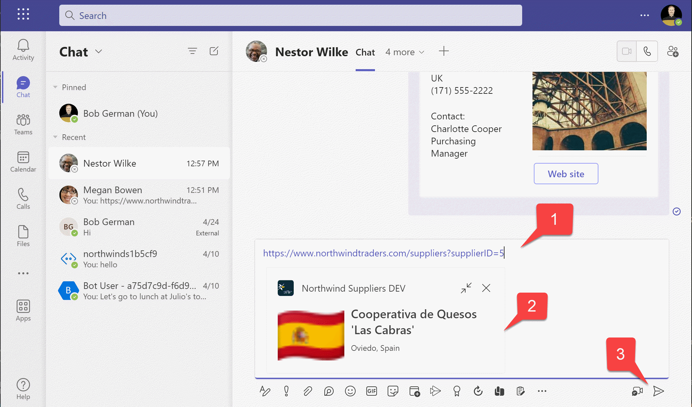
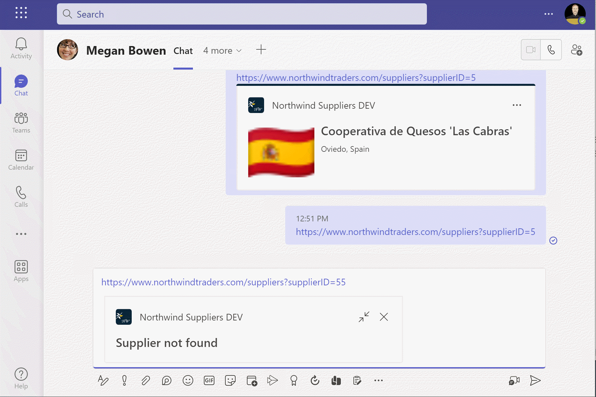

# Lab 3: Link unfurling

> #### 실습 계획 
> 
> * [**Lab 1 - Create your first app with Teams Toolkit**](./2024-01-02-1.create-app.html) 이 랩에서는 Teams Toolkit을 설정하고 Teams 메시지 확장을 만드는 방법을 알아보겠습니다.
> * [**Lab 2 - Integrate business data with your application**](./2024-01-03-2.integrate-web-service.html) 이 실습에서는 새로운 앱을 'Northwind Suppliers’라고 브랜딩하고, Microsoft Teams 대화에서 Northwind Traders 샘플 데이터베이스의 데이터를 삽입할 수 있는 기능을 제공합니다. 또한 메시지 확장을 사용하여 어댑티브 카드를 생성하고 전송하는 방법을 배우게 됩니다.
> *  [**Lab 3 - Add link unfurling**](./2024-01-04-3.add-link-unfurling.html) 이 랩에서는 사용자가 대화에 URL을 포함할 때 사용자 정의 요약을 제공하는 링크 언퍼링 기능을 사용하는 방법을 배우게 됩니다.
> * [**Lab 4 - Action message extensions with Open AI**](./2024-01-05-4.add-ai.html) 이 랩에서는 “액션” 메시지 확장 기능을 만드는 방법을 배울 수 있습니다. 이 기능은 직접 실행하거나 다른 팀 메시지의 컨텍스트 메뉴에서 실행하여 해당 메시지에 대한 작업을 수행할 수 있습니다. 이 랩에서는 Open AI 상업 웹 서비스(Azure 또는 Open AI 계정을 사용하여)를 이용하여 메시지를 생성합니다.
> * [**Lab 5 - Single Sign-on and Microsoft Graph**](./2024-01-06-5.add-sso.html) 이 실습에서는 Azure AD Single Sign-On을 사용하여 사용자를 인증하고 Microsoft Graph API를 호출하는 방법을 배웁니다. 이와 같은 과정은 로그인한 사용자를 대신하여 Azure AD로 보호되는 웹 서비스를 호출할 때 사용됩니다.
> * [**Lab 6 - Run the app in Outlook**](./2024-01-07-6.run-in-outlook.html) 이 랩에서는 Microsoft Outlook에서 Northwind Suppliers 애플리케이션을 실행합니다.
{: .block-tip }

## Overview

이번 실습에서는 링크 언퍼링(Link Unfurling)이라는 기능을 기본적으로 구현해 보겠습니다. 링크 언퍼링은 사용자가 하이퍼링크를 공유할 때 앱을 보여주는 기능입니다.

우리는 모두 링크 언퍼링을 본 적이 있지만 그 이름으로 부르지 않았을 수 있습니다. 소셜 미디어에 링크를 공유할 때 나타나는 작은 요약이 바로 링크 언퍼링입니다. 깃발을 펼치는 것처럼 하이퍼링크를 펼치는 것이라고 생각하면 됩니다. 팀즈 앱은 특정 도메인 이름의 링크를 언퍼링할 수 있도록 등록할 수 있습니다. 팀즈 대화에서 해당 도메인의 링크가 사용되면 앱이 어댑티브 카드를 표시할 수 있습니다.

이번 실습에서는 Northwind 공급업체에 대한 몇 가지 세부 정보를 표시하기만 하지만, 앱은 어댑티브 카드의 모든 기능을 포함할 수 있습니다. 예를 들어 입력 필드, 작업 버튼, 또는 팀즈 내의 앱으로 깊은 링크를 제공하는 수정된 링크 등이 있습니다. 예를 들어, 팀즈에서 앱을 사용해 본 적이 없는 사용자가 웹 기반 앱의 링크를 채팅 스레드에 붙여넣을 수 있습니다. 링크 언퍼러는 그들을 팀즈 내의 앱으로 깊은 링크하는 버튼을 표시할 수 있습니다. 이는 앱의 사용자 발견을 촉진하는 좋은 방법입니다.




## Features

- _northwindtraders.com_에서 쿼리 문자열에 있는 ID로 공급업체의 정보를 보여주는 링크 언퍼러입니다.

> #### Tip
>
> 이 실습은 [실습 1](./2024-01-02-1.create-app.html) [과 2](./2024-01-03-2.integrate-web-service.html)에서 만든 솔루션을 활용합니다. 다음 단계로 넘어가기 전에 두 실습을 모두 수행해 주십시오.
{: .block-tip }

## Exercise 1: Add a message handler to the app mainfest

비쥬얼 스튜디오 코드에서 프로젝트를 열고 **appPackage/manifest.json** 파일을 편집합니다. `composeExtensions` 아래에서 `commands` 속성을 찾습니다. `commands` 속성 바로 뒤에 새로운 속성을 추가합니다

```js
    "messageHandlers": [
        {
            "type": "link",
            "value": {
                "domains": [
                "*.northwindtraders.com"
                ]
            }
        }
    ]
```

그렇게 하면 `composeExtensions` 속성이 다음과 같이 보이게 됩니다. 바로 뒤에는 `configurableTabs`가 이어집니다:

```js
"composeExtensions": [
    {
        "botId": "${{BOT_ID}}",
        "commands": [
            {
                "id": "searchQuery",
                "context": [
                    "compose",
                    "commandBox"
                ],
                "description": "Look up a Northwind supplier",
                "title": "Supplier search",
                "type": "query",
                "parameters": [
                    {
                        "name": "searchQuery",
                        "title": "Supplier search",
                        "description": "Look up a Northwind supplier",
                        "inputType": "text"
                    }
                ]
            }
        ],
        "messageHandlers": [
            {
                "type": "link",
                "value": {
                    "domains": [
                    "*.northwindtraders.com"
                    ]
                }
            }
        ]
    }
],
```

이 코드는 Teams가 ".northwindtraders.com"이라는 와일드카드와 호스트 이름이 일치하는 링크를 찾아내도록 합니다. "*.northwindtraders.com"은 Microsoft가 데모용으로 만든 DNS 이름으로, (microsoft.com으로 이동하는) 링크입니다. 메시지 확장 기능은 [https://www.northwindtraders.com/suppliers?supplierID=5](https://www.northwindtraders.com/suppliers?supplierID=5){:target="_blank"}와 같은 링크가 입력되면 작동합니다.

## Exercise 2: Update the application code

### Step 1: Add code for the message extension

**messageExtensions** 폴더에 **northwindLinkME.js**라는 파일을 추가하고, 이 코드를 붙여넣으세요:

```js
const axios = require("axios");
const { CardFactory } = require("botbuilder");

class NorthwindLinkME {

    async handleTeamsAppBasedLinkQuery (context, query) {

        const url = query.url;

        // Ensure the host name ends with northwindtraders.com
        const host = new URL(url).hostname;
        if (host.endsWith("northwindtraders.com")) {

            // Get the supplier ID from the URL
            const supplierID = new URL(url).searchParams.get("supplierID");
            if (supplierID) {

                // Make a thumbnail card to show if the supplier is not found
                let attachment = CardFactory.thumbnailCard("Supplier not found");
                try {
                    // Get the supplier details from the Northwind OData service
                    const supplierResponse = await axios.get(
                        `https://services.odata.org/V4/Northwind/Northwind.svc/Suppliers(${supplierID})`
                    );

                    if (supplierResponse.data?.SupplierID) {

                        const supplier = supplierResponse.data;
                        const flagUrl = this.#getFlagUrl(supplier.Country);
                        attachment = CardFactory.thumbnailCard(supplier.CompanyName,
                            `${supplier.City}, ${supplier.Country}`, [flagUrl]);

                    }

                } catch (error) {
                    console.log(error);
                }

                const response = {
                    composeExtension: {
                        attachmentLayout: 'list',
                        type: 'result',
                        attachments: [attachment]
                    }
                };
                return response;

            }
        }
    }

    // Get a flag image URL given a country name
    // Thanks to https://flagpedia.net for providing flag images
    #getFlagUrl (country) {

        const COUNTRY_CODES = {
            "australia": "au",
            "brazil": "br",
            "canada": "ca",
            "denmark": "dk",
            "france": "fr",
            "germany": "de",
            "finland": "fi",
            "italy": "it",
            "japan": "jp",
            "netherlands": "nl",
            "norway": "no",
            "singapore": "sg",
            "spain": "es",
            "sweden": "se",
            "uk": "gb",
            "usa": "us"
        };

        return `https://flagcdn.com/32x24/${COUNTRY_CODES[country.toLowerCase()]}.png`;

    };
}

module.exports.NorthwindLinkME = new NorthwindLinkME();
```

> #### 코드 설명
> 
> Teams가 일치하는 호스트 이름을 가진 링크를 보면, 애플리케이션에 Invoke Activity를 보냅니다. 봇은 이를 받아서 `handleTeamsAppBasedLinkQuery` 이벤트 핸들러를 호출합니다. `NorthwindLinkME`는 이 이벤트를 처리하는 코드를 포함하고 있습니다.
>
>먼저 호스트 이름이 "northwindtraders.com"으로 끝나는지 확인합니다. 앱에 여러 개의 링크 메시지 핸들러가 있으면 이 방식으로 어떤 것인지 확인할 수 있습니다. 그 다음 URL에서 공급업체 ID를 추출하려고 시도하고, [Northwind sample OData service](https://www.odata.org/odata-services/#3){:target="_blank"}를 사용하여 공급업체를 찾습니다.
>
>공급업체를 찾으면, 공급업체의 이름, 도시, 국가, 국기를 담은 썸네일 카드를 반환합니다. 찾지 못하면, “공급업체를 찾을 수 없습니다"라는 카드를 반환합니다.
{: .block-tip }

### Step 2: Update the bot to call the NorthwindLinkME

이제 **teamsBot.js** 파일을 엽니다. 파일의 맨 위에 방금 추가한 메시지 확장 코드를 임포트합니다.

```javascript
const { NorthwindLinkME } = require("./messageExtensions/northwindLinkME");
```

이제 `TeamsBot` 클래스에 이벤트 핸들러를 추가합니다. 이전 랩에서 추가한 `handleTeamsMessagingExtensionSelectItem` 메소드 바로 아래에 추가합니다. `TeamsBot`의 기본 클래스는 봇 프레임워크의 `TeamsActivityHandler`입니다. 이 클래스는 링크를 풀어야 할 때 이 메소드를 호출할 것입니다.

```javascript
async handleTeamsAppBasedLinkQuery(context, query) {

  return NorthwindLinkME.handleTeamsAppBasedLinkQuery(context, query);

}
```

## Exercise 3: Run the app

이제 F5 키를 누르거나 실행 메뉴나 비주얼 스튜디오 코드에 표시된 여러 실행 버튼 중 하나를 사용하여 앱을 다시 실행합니다. 쿼리 메시지 확장이 나타나면 무시하고 작성 메시지 영역을 클릭하여 닫습니다.

1️⃣ 작성창에 이 URL 주소를 붙여 넣으세요

```text
https://www.northwindtraders.com/suppliers?supplierID=5
```

2️⃣ 메시지 작성 영역에 링크를 넣으면 썸네일 카드가 아래에 추가됩니다.

3️⃣ 전송 하기 위해 Send 를 클릭합니다



잘못된 supplier ID를 가진 링크를 붙여넣으세요:

```text
https://www.northwindtraders.com/suppliers?supplierID=55
```

supplierID 55는 존재하지 않으므로, 카드는 에러를 표시합니다



지우고, 아래의 링크를 붙여넣습니다. 이 주소에는 supplier를 참조하지 않습니다.

```text
https://www.northwindtraders.com/
```

이 링크는 supplier가 지정되어 있는지 코드로 확인하기 때문에 펼쳐지지 않고 null을 반환합니다.

## Next Steps

<a href="./2024-01-05-4.add-ai.html">

</a>

이 실습을 완료한 후에는 이 학습 경로의 다음 실습인 [Lab 4 - Action message extensions with Open AI](./2024-01-05-4.add-ai.html)으로 계속 진행할 수 있습니다.

## Known issues

최신 문제점이나 버그 리포트를 보려면 이 저장소의 [GitHub issues](https://github.com/microsoft/app-camp/issues){:target="_blank"} 목록을 참조하세요.