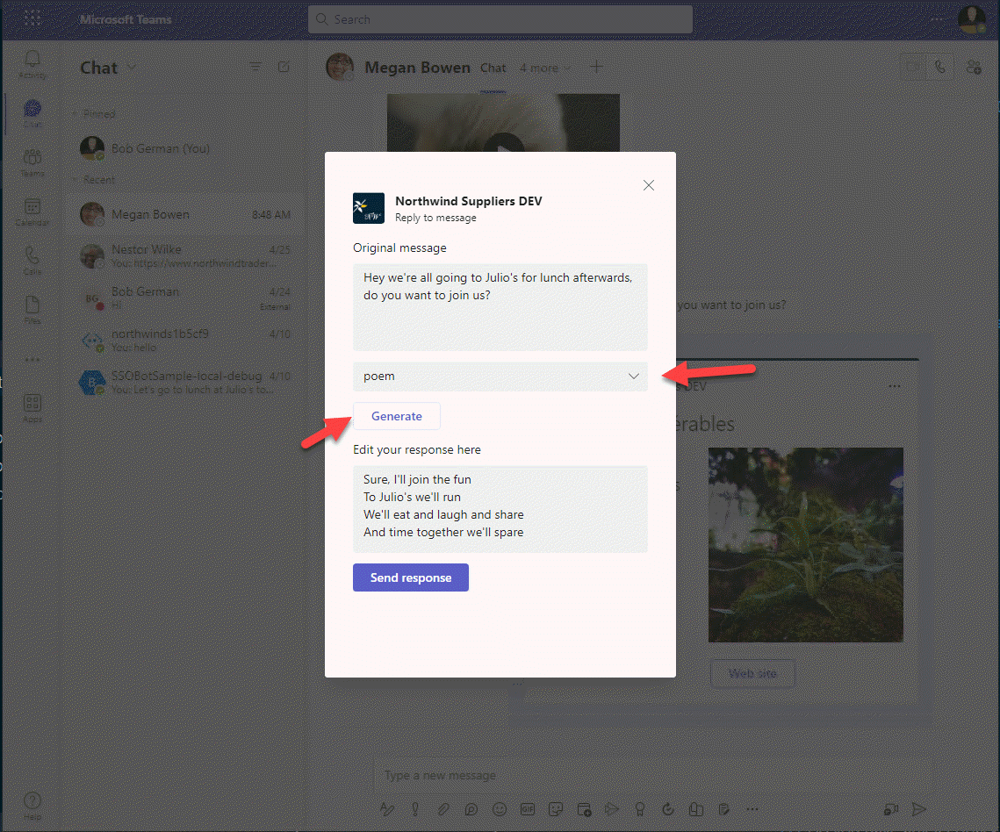
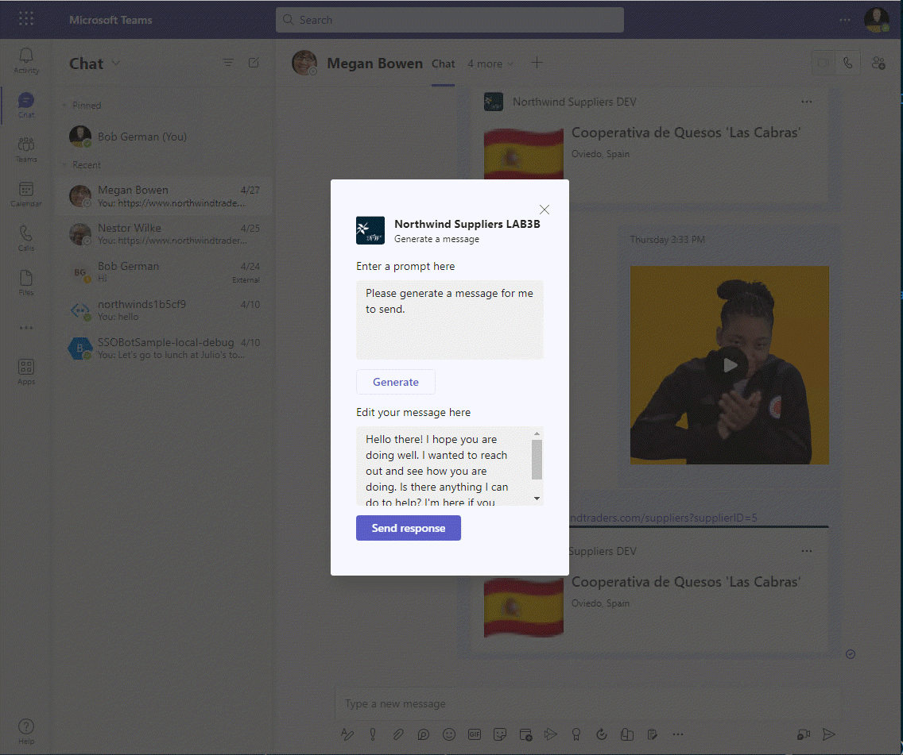
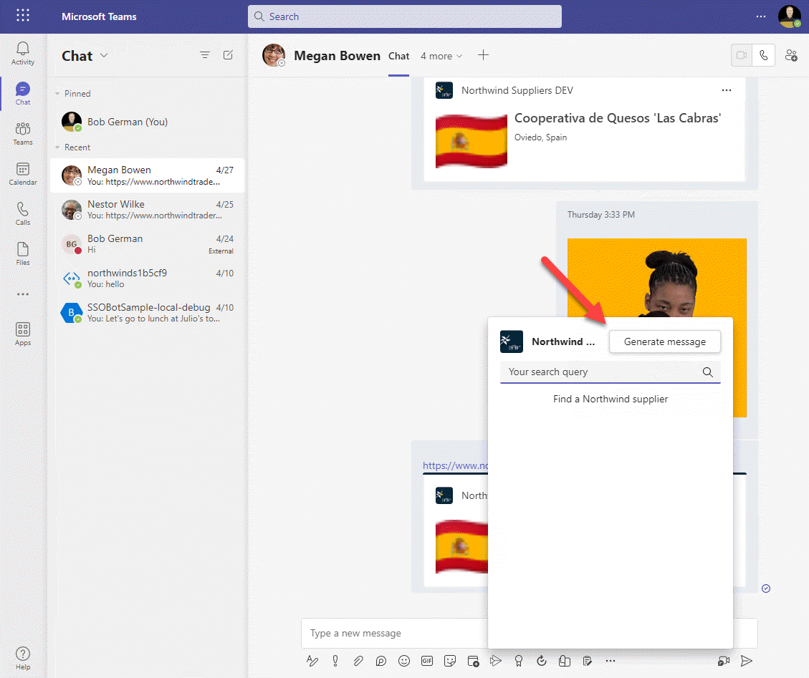
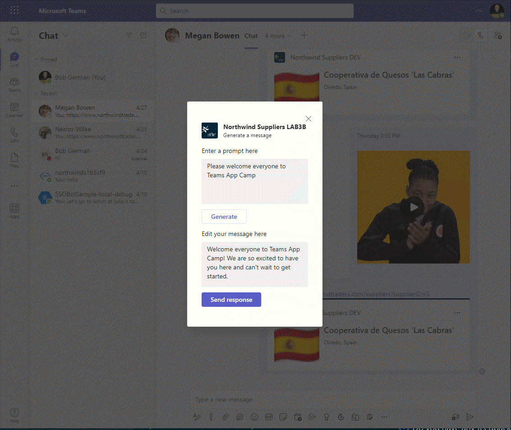
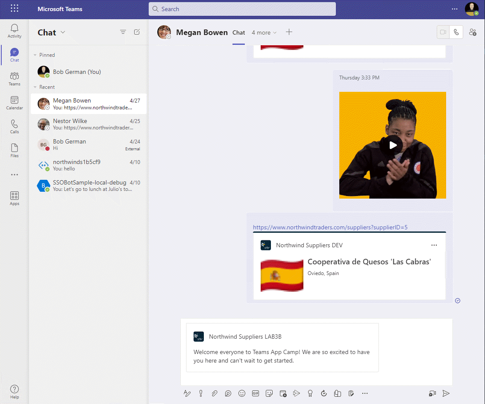
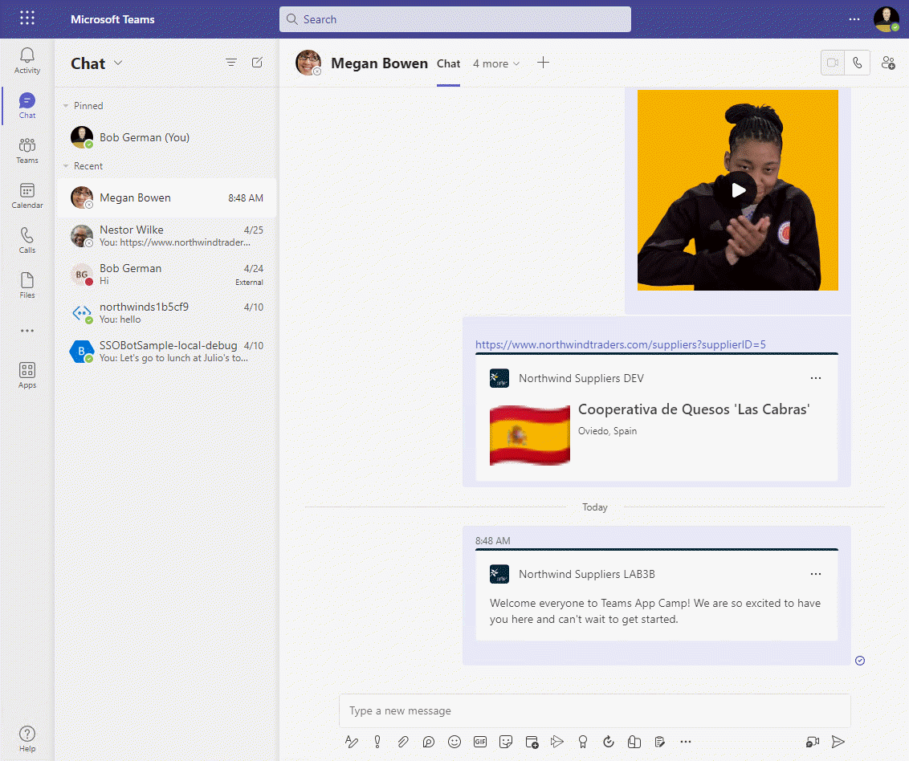
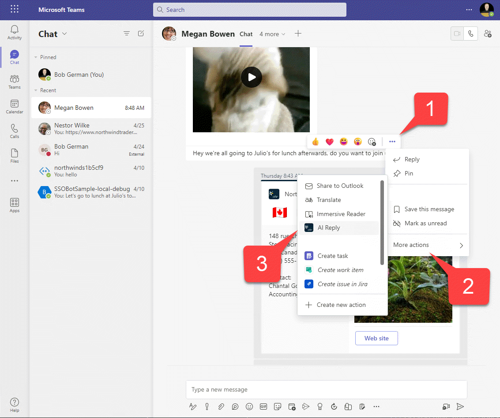
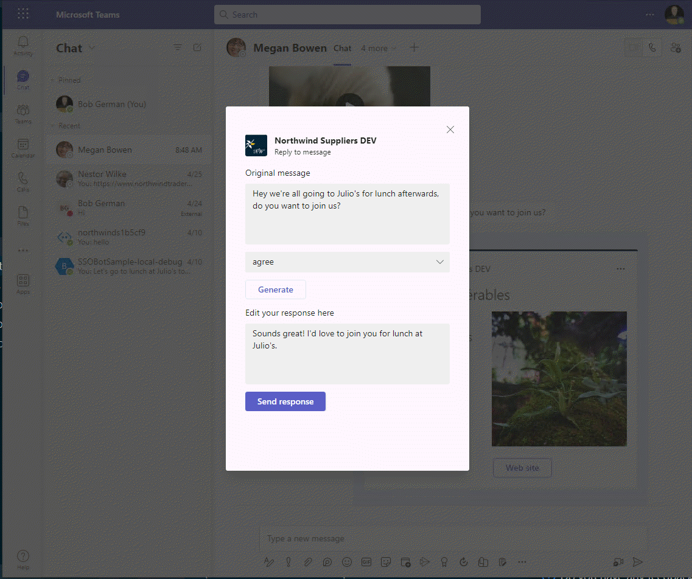
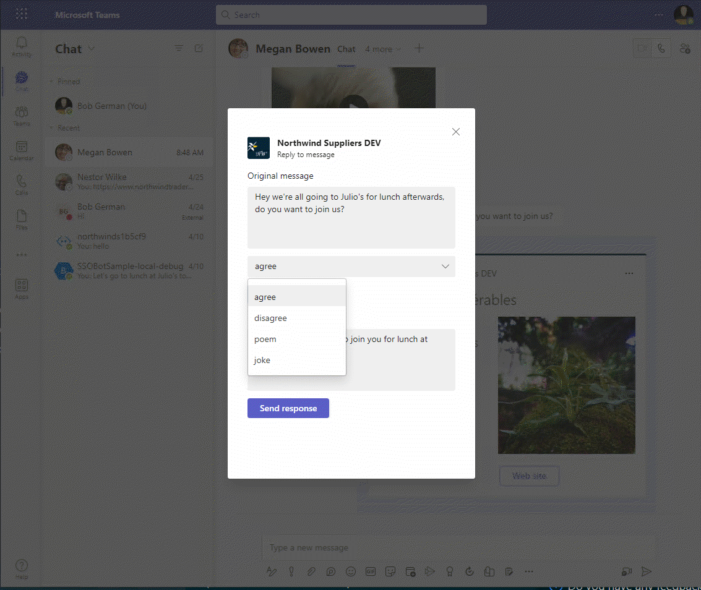
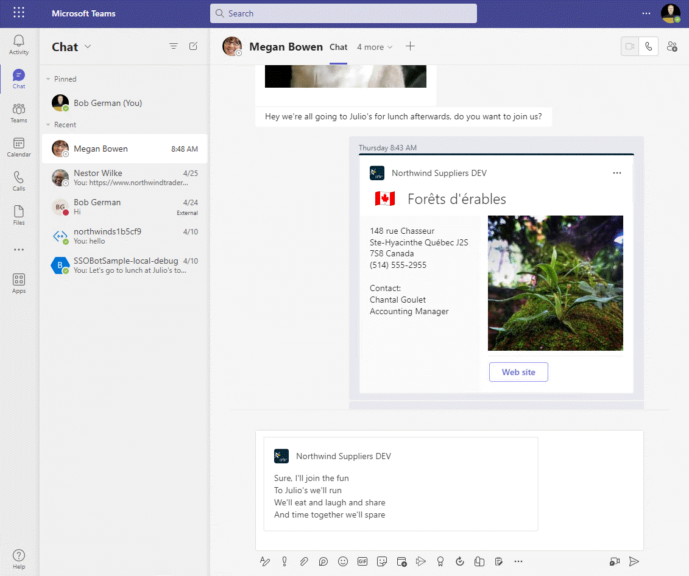

# Lab 4: Action message extensions with Open AI

> #### 실습 계획 
> 
> * [**Lab 1 - Create your first app with Teams Toolkit**](./2024-01-02-1.create-app.html) 이 랩에서는 Teams Toolkit을 설정하고 Teams 메시지 확장을 만드는 방법을 알아보겠습니다.
> * [**Lab 2 - Integrate business data with your application**](./2024-01-03-2.integrate-web-service.html) 이 실습에서는 새로운 앱을 'Northwind Suppliers’라고 브랜딩하고, Microsoft Teams 대화에서 Northwind Traders 샘플 데이터베이스의 데이터를 삽입할 수 있는 기능을 제공합니다. 또한 메시지 확장을 사용하여 어댑티브 카드를 생성하고 전송하는 방법을 배우게 됩니다.
> * [**Lab 3 - Add link unfurling**](./2024-01-04-3.add-link-unfurling.html) 이 랩에서는 사용자가 대화에 URL을 포함할 때 사용자 정의 요약을 제공하는 링크 언퍼링 기능을 사용하는 방법을 배우게 됩니다.
> *  [**Lab 4 - Action message extensions with Open AI**](./2024-01-05-4.add-ai.html) 이 랩에서는 “액션” 메시지 확장 기능을 만드는 방법을 배울 수 있습니다. 이 기능은 직접 실행하거나 다른 팀 메시지의 컨텍스트 메뉴에서 실행하여 해당 메시지에 대한 작업을 수행할 수 있습니다. 이 랩에서는 Open AI 상업 웹 서비스(Azure 또는 Open AI 계정을 사용하여)를 이용하여 메시지를 생성합니다.
> * [**Lab 5 - Single Sign-on and Microsoft Graph**](./2024-01-06-5.add-sso.html) 이 실습에서는 Azure AD Single Sign-On을 사용하여 사용자를 인증하고 Microsoft Graph API를 호출하는 방법을 배웁니다. 이와 같은 과정은 로그인한 사용자를 대신하여 Azure AD로 보호되는 웹 서비스를 호출할 때 사용됩니다.
> * [**Lab 6 - Run the app in Outlook**](./2024-01-07-6.run-in-outlook.html) 이 랩에서는 Microsoft Outlook에서 Northwind Suppliers 애플리케이션을 실행합니다.
{: .block-tip }

## Overview

이 랩에서는 다음을 배우게 됩니다:

- Microsoft Teams의 작성 상자에서 액세스할 수 있는 액션 메시지 확장을 만듭니다.
- Microsoft Teams에서 메시지에 대한 액션을 수행할 수 있는 액션 메시지 확장을 만듭니다.
- FetchTask 및 SubmitAction 활동을 통해 대화형으로 사용자와 상호 작용하는 적응형 카드를 사용합니다.
- Azure OpenAI 리소스 또는 OpenAI 공개 웹 서비스에 대한 OpenAI API를 호출합니다.

## Features

- Open AI를 사용하여 Microsoft Teams에서 메시지를 작성하는 데 도움이 되는 액션 메시지 확장
- 기존 메시지의 컨텍스트 메뉴에서 작동하는 액션 메시지 확장으로, Microsoft Teams에서 메시지에 대한 응답을 작성하는 데 도움이 됩니다.

예를 들어, 다음은 응답 메시지 확장의 작동 방식입니다. 적응형 카드를 사용하여 사용자와 상호 작용하고 동의, 반대, 시, 농담 등의 응답을 허용합니다.

## Exercise 1: Obtain an OpenAI API key and the code to call OpenAI

여기에는 두 가지 접근 방식이 있습니다:

1. text-davinci-003과 같은 모델을 사용하여 Azure OpenAI 리소스를 설정하고 다음 정보를 얻습니다.
2. OpenAI의 공개 API에 접근하기 위해 OpenAI 계정을 설정합니다.

이 중 하나의 접근 방식을 선택하고 아래의 안내를 따르십시오.

### Option 1: Use an Azure OpenAI resource

이 방법은 Azure 구독에 접근할 수 있고, 공유 온라인 서비스가 아닌 자신의 Azure 구독 내에서 데이터를 유지하고 싶을 때 좋은 접근 방식입니다. [설정 방법은 여기에 있습니다](https://azure.microsoft.com/en-us/products/cognitive-services/openai-service){:target="_blank"}.

Azure 리소스가 실행되면, 애플리케이션에서 접근하기 위해 서비스에 대한 다음 정보가 필요합니다:

Endpoint 1️⃣ - OpenAI 리소스를 생성할 때 할당됩니다 
Model 2️⃣ - AI 모델 배포를 생성합니다; 이 실습에는 text-davinci-003 모델이 잘 작동합니다. 모델 배포 목록의 왼쪽 열에서 "Model deployment name"이 필요합니다. 
Version - 이것은 API 버전입니다; 현재는 "2023-03-15-preview"를 사용합니다 
API Key 3️⃣ - API 키를 얻습니다

다음으로, **env/.env.local** 파일을 편집하고 다음 줄을 추가하고, 위의 정보를 채웁니다.

~~~text
AZURE_OPENAI_BASE_PATH=https://something.openai.azure.com/openai
AZURE_OPENAI_MODEL=text-davinci-003
AZURE_OPENAI_API_VERSION=2023-03-15-preview
~~~

API 키는 비밀이므로 다음과 같이 **env/.env.local.user** 파일에 추가하세요:

~~~text
SECRET_AZURE_OPENAI_API_KEY=xxxxxxxxxxxxxxx
~~~

하지만 이것들은 실제 .env 파일은 아닙니다. 코드가 값을 읽을 수 있도록 하려면 Teams Toolkit에 런타임에 .env 파일에 추가하도록 지시해야 합니다. 이렇게 하려면 **teamsapp.local.yml** 파일을 편집하세요. 기존의 `envs`에 대한 설정 아래에 다음과 같이 줄을 추가하세요:

~~~yaml
  - uses: file/createOrUpdateEnvironmentFile # Generate runtime environment variables
    with:
      target: ./.localConfigs
      envs:
        BOT_ID: ${{BOT_ID}}
        BOT_PASSWORD: ${{SECRET_BOT_PASSWORD}}
        AZURE_OPENAI_BASE_PATH: ${{AZURE_OPENAI_BASE_PATH}}
        AZURE_OPENAI_MODEL: ${{AZURE_OPENAI_MODEL}}
        AZURE_OPENAI_API_VERSION: ${{AZURE_OPENAI_API_VERSION}}
        AZURE_OPENAI_API_KEY: ${{SECRET_AZURE_OPENAI_API_KEY}}
~~~

> #### .yml 파일에서 들여쓰기는 중요합니다.
> 
> 이것은 들여쓰기에 민감한 “yaml” 파일입니다. 추가하는 줄이 `BOT_ID`와 `BOT_PASSWORD` 항목과 같은 들여쓰기를 하지 않으면 작동하지 않습니다.
{: .block-tip }

이제 Azure OpenAI 서비스를 호출하는 코드를 추가해 봅시다. 프로젝트 내에 **services**라는 폴더를 만듭니다. 이 새 폴더에 **azureOpenAiService.js**라는 파일을 만들고 다음 코드를 붙여 넣습니다:

~~~js
const {  OpenAI } = require("openai");

class AzureOpenAiService {
    constructor() {
        this.openai = new OpenAI({            
            basePath:process.env.AZURE_OPENAI_BASE_PATH +
                       "/deployments/" + process.env.AZURE_OPENAI_MODEL
        });
    }
    async generateMessage(prompt) {

        try {

            const response = await this.openai.completions.create({
                prompt: prompt,
                model:"text-davinci-003",
                temperature: 0.6,
                max_tokens: 100
            }, {
                headers: {
                    'api-key': process.env.AZURE_OPENAI_API_KEY,
                  },
                  params: { "api-version": process.env.AZURE_OPENAI_API_VERSION }
            });

            let result = response.choices[0].text;

            return result.trim();

        } catch (e) {

            console.log(`Error ${e.response.status} ${e.response.statusText}`);
            return "Error";

        }

    }
}

module.exports.OpenAiService = new AzureOpenAiService();
~~~

### Option 2: Use the OpenAI Platform

OpenAI에서 AI 서비스를 직접 이용하고 싶다면 이 방법이 좋습니다. OpenAI 시험 계정으로 빠르게 시작할 수 있는 방법입니다. 서비스를 이용하려면 [API 키를 발급받아야](https://platform.openai.com/account/api-keys){:target="_blank"} 합니다. Chat GPT를 오랫동안 사용해 왔다면 시험 API 접근이 이미 만료되었을 수도 있습니다. [사용량 페이지](https://platform.openai.com/account/usage){:target="_blank"}에서 상태를 확인하세요.

실습에 필요한 것은 OpenAI API 키뿐입니다. 이 키는 비밀이므로 Teams Toolkit 로그에 표시되지 않아야 합니다. 따라서 **env/.env.local.user** 파일에 `SECRET`으로 시작하는 이름으로 저장해야 합니다:

~~~text
SECRET_OPENAI_API_KEY=your-key-here-xxxxxx
~~~

하지만 이것은 실제 .env 파일이 아닙니다. *.env.local*도 아닙니다. 코드가 값을 읽을 수 있도록 하려면 Teams Toolkit에 런타임에 .env 파일에 추가하도록 지시해야 합니다. 이를 위해 **teamsapp.local.yml** 파일을 편집하세요. 기존의 `envs` 설정 아래에 다음과 같은 줄을 추가하세요:

~~~yaml
  - uses: file/createOrUpdateEnvironmentFile # Generate runtime environment variables
    with:
      target: ./.localConfigs
      envs:
        BOT_ID: ${{BOT_ID}}
        BOT_PASSWORD: ${{SECRET_BOT_PASSWORD}}
        OPENAI_API_KEY: ${{SECRET_OPENAI_API_KEY}}
~~~

> #### .yml 파일에서 들여쓰기는 중요합니다.
> 
> 이것은 들여쓰기에 민감한 “yaml” 파일입니다. 추가하는 줄이 `BOT_ID`와 `BOT_PASSWORD` 항목과 같은 들여쓰기를 하지 않으면 작동하지 않습니다.
{: .block-tip }

다음으로 OpenAI 서비스를 호출하는 코드를 추가해 보겠습니다. 프로젝트에 **services**라는 폴더를 만듭니다. 이 새 폴더에 **openAiService.js**라는 파일을 만들고 다음 코드를 붙여 넣습니다:

~~~js
const { OpenAI } = require("openai");

class OpenAiService {
    constructor() {
        this.openai = new OpenAI({
            apiKey: process.env.OPENAI_API_KEY 
        });
    }

    async generateMessage(prompt) {

        try {

            const response = await this.openai.completions.create({
                model: "text-davinci-003",
                prompt: prompt,
                temperature: 0.6,
                max_tokens: 100
            });        
            let result = response.choices[0].text;
            return result.trim();

        } catch (e) {

            console.log(`Error ${e.response.status} ${e.response.statusText}`);
            return "Error";

        }

    }
}

module.exports.OpenAiService = new OpenAiService();
~~~

> #### 코드 설명
> 
> 애저 오픈AI와 오픈AI 서비스는 매우 비슷하다는 것을 알 수 있습니다. 둘 다 프롬프트를 사용하여 openAiClient.createCompletion() 함수를 호출하는 `generateMessage()` 함수를 가지고 있으며, AI 모델로부터 응답을 받습니다.
>
>또한 둘 다 [OpenAI API](https://github.com/openai/openai-node){:target="_blank"}를 사용합니다. 이것은 NodeJS에서 오픈AI 서비스를 호출하기 위한 클라이언트 측 라이브러리입니다.
{: .block-tip }

## Exercise 2: Install the Open AI API package

이전 연습에서는 OpenAI API를 사용하는 코드를 추가했지만, 아직 npm 모듈을 설치하지 않았습니다. 이 모듈은 아주어 오픈AI와 오픈AI 플랫폼 모두에 적용됩니다.

Visual Studio Code나 로컬 운영체제에서 터미널 창을 열고 **NorthwindSuppliers** 프로젝트 폴더로 이동합니다. 그리고 다음 명령어를 입력합니다: 

~~~sh
npm install openai
~~~

## Exercise 3: Add Action message extensions to the Teams manifest

AI 서비스를 기반으로 만들었으니, 이제 메시지 확장을 만들어 보겠습니다. 두 가지 확장이 있습니다: 하나는 새로운 메시지를 생성하고 작성 상자 팝업 옆에 있는 버튼에서 접근할 수 있으며, 다른 하나는 메시지에 답장하고 메시지의 컨텍스트 메뉴에서 접근할 수 있습니다.

코드 편집기에서 **appPackage/manifest.json** 파일을 열고 `composeExtensions` 내의 `commands` 배열에 다음 두 요소를 추가하세요:

~~~js
    {
        "id": "generateMessage",
        "context": [
            "compose",
            "commandBox"
        ],
        "description": "Generate a message using AI",
        "title": "Generate message",
        "type": "action",
        "fetchTask": true
    },
    {
        "id": "replyToMessage",
        "context": [
            "message"
        ],
        "description": "Generate an agreeable response",
        "title": "AI Reply",
        "type": "action",
        "fetchTask": true
    }
~~~

> #### Tip
>
> "searchQuery" 명령어와 구분해 주세요. JSON이 처음이시고, 중첩된 괄호들이 조금 혼란스럽다면, 업데이트된 **manifest.json** 파일을 [여기](https://github.com/microsoft/app-camp/blob/main/src/teams-toolkit/Lab04-AIExtension/NorthwindSuppliers/appPackage/manifest.json){:target="_blank"}서 복사해서 사용하셔도 됩니다.
{: .block-tip }

새로운 명령어들이 `action` 타입이고, `fetchTask`가 `true`로 설정된 것을 확인하세요. 이렇게 하면 팀즈가 서비스에서 적응형 카드를 가져와서 사용자가 애플리케이션과 상호작용할 수 있도록 카드를 담은 대화상자를 표시합니다. 웹 페이지도 이런 방식으로 표시할 수 있지만, 이번 실습에서는 적응형 카드만 사용할 것입니다.

또한 `generateMessage` 액션은 팀즈 사용자 인터페이스 상단의 `compose` 박스나 `commandBox`에서 실행되고, `replyToMessage` 액션은 message에서 실행된다는 것에 주의하세요. 이러한 설정은 팀즈가 액션 메시지 확장을 표시하는 위치를 제어합니다.

## Exercise 4: Add a message extension to generate a message

### Step 1: Add JavaScript code

이제 예전처럼, 우리는 메시지 확장 기능마다 별도의 자바스크립트 모듈을 만들 것입니다. **messageExtensions** 폴더에 **generateMessageME.js**라는 새 파일을 만드세요. 파일에 이 코드를 붙여넣으세요:

~~~js
const ACData = require("adaptivecards-templating");
const { CardFactory } = require("botbuilder");
const { OpenAiService } = require("../services/azureOpenAiService");
// const { OpenAiService } = require("../services/openAiService");

class GenerateMessageME {

    // Ref documentation
    // https://learn.microsoft.com/en-us/microsoftteams/platform/messaging-extensions/how-to/action-commands/define-action-command

    async handleTeamsMessagingExtensionFetchTask (context, action) {
        try {
            return this.#displayAdaptiveCardResponse("Please generate a message for me to send.");
        } catch (e) {
            console.log(e);
        }
    }

    async handleTeamsMessagingExtensionSubmitAction (context, action) {

        try {

            switch (action.data?.intent) {
                case "send": {
                    return await this.#sendMessageResponse(action.data?.message);
                }
                default: {
                    return await this.#displayAdaptiveCardResponse(action.data?.prompt);
                }
            }
        }
        catch (e) {
            console.log(e);
        }
    }

    // Generate a response that will display the adaptive card form in Teams
    async #displayAdaptiveCardResponse (prompt) {

        const text = await OpenAiService.generateMessage(prompt);

        // Read card from JSON file
        const templateJson = require('../cards/generateMessageCard.json');
        const template = new ACData.Template(templateJson);
        const cardContents = template.expand({
            $root: {
                prompt: prompt,
                message: text
            }
        });

        const card = CardFactory.adaptiveCard(cardContents);
        return {
            task: {
                type: 'continue',
                value: {
                    card: card,
                    height: 400,
                    title: 'Generate a message',
                    width: 300
                }
            }
        };
    }

    // Generate a response that will add a message to the Teams compose box
    async #sendMessageResponse (message) {

        const messageHtml = message.replace(/\n/g, " ");

        const heroCard = CardFactory.heroCard('', messageHtml);
        const attachment = {
            contentType: heroCard.contentType,
            content: heroCard.content,
            preview: heroCard
        };

        return {
            composeExtension: {
                type: 'result',
                attachmentLayout: 'list',
                attachments: [
                    attachment
                ]
            }
        };
    }

}

module.exports.GenerateMessageME = new GenerateMessageME();
~~~

> #### OpenAI 플랫폼 서비스를 사용하는 경우에는 조정해야 합니다.
> 
> Azure OpenAI를 사용하고 있다면, 이 코드는 바로 실행할 수 있습니다. 공개 OpenAI 플랫폼을 사용하고 있다면, `/services/azureOpenAiService`에 대한 `require` 문을 주석 처리하고, `/services/openAiService`에 대한 것을 주석 해제해야 합니다.
{: .warning-tip }

> #### 코드 설명
> 
> 방금 추가한 코드를 살펴보세요.
>
> `handleTeamsMessagingExtensionFetchTask()` 함수는 사용자가 액션 메시지 확장을 호출할 때 실행됩니다. 이 함수는 "continue" 태스크의 일부로 어댑티브 카드를 반환하는데, 이는 Teams에게 카드를 표시하고 사용자와 상호 작용하라고 알려줍니다. `#displayAdaptiveCardResponse()` 함수는 표시할 어댑티브 카드를 포함한 Teams에 대한 응답을 생성합니다.
>
> 사용자가 어댑티브 카드의 버튼을 클릭하면, 카드 데이터가 제출되고 `handleTeamsMessagingExtensionSubmitAction()` 함수가 실행됩니다. `send` 버튼을 눌렀다면, `#sendMessageResponse` 함수는 메시지를 담은 히어로 카드를 포함한 응답을 반환합니다. 이는 생성된 메시지를 사용자가 보낼 수 있도록 작성 상자에 삽입합니다.
{: .block-tip }

### Step 2: Add the adaptive card

실습 2에서 만든 **cards** 폴더에 새 파일 **generateMessageCard.json**을 추가하세요. 이 파일에 이 JSON을 붙여넣으세요.

~~~js
{
    "type": "AdaptiveCard",
    "$schema": "http://adaptivecards.io/schemas/adaptive-card.json",
    "version": "1.4",
    "body": [
        {
            "type": "Input.Text",
            "label": "Enter a prompt here",
            "isMultiline": true,
            "value": "${prompt}",
            "id": "prompt"
        },
        {
            "type": "ActionSet",
            "actions": [
                {
                    "type": "Action.Submit",
                    "title": "Generate",
                    "data": {
                        "intent": "generate"
                    }
                }
            ]
        },
        {
            "type": "Input.Text",
            "label": "Edit your message here",
            "isMultiline": true,
            "value": "${message}",
            "id": "message"
        }
    ],
    "actions": [
        {
            "type": "Action.Submit",
            "title": "Send response",
            "data": {
                "intent": "send"
            }
        }
    ]
}
~~~

{: .note-title }
> 코드 설명
> 
> 카드가 표시될 때 다음과 같은 모습입니다:
> 
>    
> 카드에는 "Generate"와 "Send"라는 2개의 버튼이 있습니다. 이 버튼들은 카드 JSON에 있는 2개의 `Action.Submit` 액션에 해당합니다. 이 버튼들은 모두 봇에서 `handleTeamsMessagingExtensionSubmitAction()` 이벤트를 발생시키고, 이 이벤트는 **generateMessageME.js** 파일에 있는 해당 함수를 호출합니다. 그렇다면 메시지 익스텐션은 어떤 버튼이 눌렸는지 어떻게 알 수 있을까요?
>
> 답은 각 액션이 카드의 입력 필드 외에도 조금 더 많은 데이터를 전송한다는 것입니다. 첫 번째 `Action.Submit`은 intent 속성 값으로 "generate"를 보내고, 두 번째 `Action.Submit`은 `intent` 값으로 `"send"`를 보냅니다. **generateMessageME.js** 파일의 코드는 이 값을 사용하여 어떤 버튼이 눌렸는지 판단합니다.

## Exercise 5: Add a message extension to reply to a message

### Step 1: Add JavaScript code

**messageExtensions** 폴더에 **replyME.js**라는 새 파일을 만듭니다. 이 코드를 파일에 붙여넣습니다:

~~~js
const ACData = require("adaptivecards-templating");
const { CardFactory } = require("botbuilder");
const { OpenAiService } = require("../services/azureOpenAiService");
// const { OpenAiService } = require("../services/openAiService");

class ReplyME {

    // Ref documentation
    // https://learn.microsoft.com/en-us/microsoftteams/platform/messaging-extensions/how-to/action-commands/define-action-command

    async handleTeamsMessagingExtensionFetchTask(context, action) {
        try {

            const userMessage = this.#getUserMessage(action);
            return this.#displayAdaptiveCardResponse(userMessage, "agree");

        } catch (e) {
            console.log(e);
        }
    }

    async handleTeamsMessagingExtensionSubmitAction(context, action) {

        try {

            const userMessage = action.data?.message;
            const replyType = action.data?.replyType;

            switch (action.data?.intent) {
                case "send": {
                    return await this.#sendMessageResponse(action.data?.replyText);
                }
                default: {
                    return this.#displayAdaptiveCardResponse(userMessage, replyType);
                }
            }

        }

        catch (e) {
            console.log(e);
        }
    }

    // Get the original message the user invoked the ME on and also the type
    // of response indicated in the adaptive card (agree, disagree, poem, or joke).
    // Default to "agree" if we're displaying the 1st adaptive card
    #getUserMessage(action) {
        let userMessage = action.messagePayload?.body?.content;
        const messageType = action.messagePayload?.body?.contentType;
        if (messageType === "html") {
            userMessage = userMessage.replace(/<[^>]*>?/gm, '');
        }

        return userMessage;
    }

    // Generate a response that will display the adaptive card form in Teams
    async #displayAdaptiveCardResponse(message, replyType) {

        const prompt = this.#getPrompt(message, replyType);
        const replyText = await OpenAiService.generateMessage(prompt);

        // Read card from JSON file
        const templateJson = require('../cards/replyCard.json');
        const template = new ACData.Template(templateJson);
        const cardContents = template.expand({
            $root: {
                message: message,
                replyText: replyText,
                replyType: replyType
            }
        });

        const card = CardFactory.adaptiveCard(cardContents);
        return {
            task: {
                type: 'continue',
                value: {
                    card: card,
                    height: 500,
                    title: `Reply to message`,
                    width: 400
                }
            }
        };

    }

    // Generate a response that will add a message to the Teams compose box
    async #sendMessageResponse(messageText) {

        const messageHtml = messageText.replace(/\n/g, " ");

        const heroCard = CardFactory.heroCard('', messageHtml);
        const attachment = {
            contentType: heroCard.contentType,
            content: heroCard.content,
            preview: heroCard
        };

        return {
            composeExtension: {
                type: 'result',
                attachmentLayout: 'list',
                attachments: [
                    attachment
                ]
            }
        };
    }

    // Get the OpenAI prompt based on the user message and reply type
    #getPrompt(userMessage, replyType) {

        switch (replyType) {
            case "agree": {
                return `Please generate an agreeable response to the following message: "${userMessage}"`;
            }
            case "disagree": {
                return `Please generate a polite response in disagreement to the following message: "${userMessage}"`;
            }
            case "poem": {
                return `Please generate a short poem in response to the following message: "${userMessage}"`;
            }
            case "joke": {
                return `Please generate a dad joke in response to the following message: "${userMessage}"`;
            }
            default: {
                return `Please respond to the following message: "${userMessage}"`;
            }
        }
    }
}

module.exports.ReplyME = new ReplyME();
~~~

> #### OpenAI 플랫폼 서비스를 사용하는 경우 조정하세요.
> 
> Azure OpenAI를 사용하고 있다면 이 코드는 바로 실행할 수 있습니다. 공개 OpenAI 플랫폼을 사용하고 있다면 `/services/azureOpenAiService`에 대한 `require` 문을 주석 처리하고 `/services/openAiService`에 대한 것을 주석 해제해야 합니다.
{: .block-tip }

### Step 2: Add the adaptive card

실습 2에서 만든 **cards** 폴더에 새 파일 **replyCard.json**을 추가하세요. 이 파일에 다음 JSON을 붙여넣으세요.

~~~js
{
    "type": "AdaptiveCard",
    "$schema": "http://adaptivecards.io/schemas/adaptive-card.json",
    "version": "1.4",
    "body": [
        {
            "type": "Input.Text",
            "label": "Original message",
            "isMultiline": true,
            "value": "${message}",
            "id": "message"
        },
        {
            "type": "Input.ChoiceSet",
            "choices": [
                {
                    "title": "agree",
                    "value": "agree"
                },
                {
                    "title": "disagree",
                    "value": "disagree"
                },
                {
                    "title": "poem",
                    "value": "poem"
                },
                {
                    "title": "joke",
                    "value": "joke"
                }
            ],
            "value": "${replyType}",
            "placeholder": "Select a response type",
            "id": "replyType"
        },
        {
            "type": "ActionSet",
            "actions": [
                {
                    "type": "Action.Submit",
                    "title": "Generate",
                    "data": {
                        "intent": "generate"
                    }
                }
            ]
        },
        {
            "type": "Input.Text",
            "label": "Edit your response here",
            "isMultiline": true,
            "value": "${replyText}",
            "id": "replyText"
        }
    ],
    "actions": [
        {
            "type": "Action.Submit",
            "title": "Send response",
            "data": {
                "intent": "send"
            }
        }
    ]
}
~~~

## Exercise 6: Update the bot code to call the message extensions

이제 메시지 확장 코드가 준비되었으니, 남은 것은 봇에서 호출하는 것뿐입니다. 이것은 다른 메시지 확장과 같은 방식으로 작동하지만 다른 이벤트가 발생합니다.

먼저 **teamsBot.js** 파일을 열고, `SupplierME`에 대한 `require` 문장 아래에 이 줄들을 추가하세요.

~~~js
const { GenerateMessageME } = require("./messageExtensions/generateMessageME");
const { ReplyME } = require("./messageExtensions/replyME");
~~~

`handleTeamsAppBasedLinkQuery` 함수 아래에 이 이벤트 핸들러들을 추가하세요.

~~~js
  async handleTeamsMessagingExtensionFetchTask(context, action) {

    switch (action.commandId) {
      case "generateMessage": {
        return await GenerateMessageME.handleTeamsMessagingExtensionFetchTask(context, action);
      }
      case "replyToMessage": {
        return await ReplyME.handleTeamsMessagingExtensionFetchTask(context, action);
      }
      default: {
        return null;
      }
    }
  }

  async handleTeamsMessagingExtensionSubmitAction(context, action) {

    switch (action.commandId) {
      case "generateMessage": {
        return await GenerateMessageME.handleTeamsMessagingExtensionSubmitAction(context, action);
      }
      case "replyToMessage": {
        return await ReplyME.handleTeamsMessagingExtensionSubmitAction(context, action);
      }
      default: {
        return null;
      }
    }
  }
~~~

## Exercise 7: Run the solution

드디어 순간이 왔습니다 - F5 키를 누르거나 Teams Toolkit에서 실행 버튼을 클릭할 시간입니다. 이전과 마찬가지로 잠시 실행되고 나서 Teams 애플리케이션 설치 화면이 포함된 브라우저를 엽니다. 앱을 설치하면 메시지 확장이 열린 채로 채팅에 착륙해야 합니다. 이번에는 그러나 “메시지 생성” 버튼이 포함됩니다.

### Step 1: Test the Generate Message button

“메시지 생성” 버튼을 클릭해 보세요. **cards/generateMessageCard.json**에 있는 템플릿을 기반으로 한 적응형 카드를 표시하는 대화 상자가 나타납니다. 초기 프롬프트와 함께 Teams 채팅에 보낼 수 있는 AI가 생성한 메시지가 표시됩니다.

사용자는 "응답 보내기"를 클릭하여 메시지를 즉시 보낼 수 있거나, 프롬프트를 편집하고 "생성"을 클릭할 수 있습니다. 이렇게 하면 사용자는 반복하고 보내고 싶은 메시지를 생성하기 위한 최상의 프롬프트를 찾을 수 있습니다.

사용자가 “생성” 버튼을 클릭하면 **messageExtensions/generateMessageME.js**에 있는 코드가 업데이트된 적응형 카드가 포함된 `continue` 응답으로 응답합니다. 사용자가 "보내기" 버튼을 클릭하면, 코드는 대화에 삽입되는 히어로 카드가 포함된 `result` 응답으로 응답합니다.

이 기술을 사용하면 사용자를 다양한 적응형 카드와 웹 페이지의 시퀀스를 통해 안내한 다음 다른 사용자가 작업할 수 있는 카드를 대화에 삽입할 수 있습니다.

검색 메시지 확장과 마찬가지로 이 작업 메시지 확장은 작성 상자에 콘텐츠를 삽입합니다. 사용자는 카드를 포함한 자신의 메시지를 편집하고 보내기를 클릭하여 대화에 공유할 수 있습니다.

### Step 2: Test the message reply feature

먼저, 애플리케이션이 실행되고 있는 팀즈 채팅에 메시지를 보내세요. 간단한 텍스트 메시지여야 합니다.

1️⃣ 메시지 위에 마우스를 올리거나 탭하여 메시지의 컨텍스트 메뉴를 표시하세요. "…"을 클릭하세요. "..."

2️⃣ "더 많은 작업"을 클릭하세요. 이렇게 하면 메시지에 대한 작업을 수행할 수 있는 컨텍스트 메뉴가 열리고, 앱이 "AI Reply"라는 이름으로 그 메뉴에 있어야 합니다

3️⃣ "AI Reply"를 클릭하세요.

"AI ReplyC” 버튼을 클릭하면 **cards/replyCard.jso**n 템플릿을 기반으로 한 어댑티브 카드가 표시되는 대화 상자가 열립니다."

원본 메시지와 응답 유형을 선택할 수 있는 드롭다운이 표시됩니다. 기본값은 "agree"이지만 다른 옵션도 있습니다.

다른 옵션 중 하나를 선택하고 "Generate"를 클릭하세요. 이전과 마찬가지로, 메시지 익스텐션은 업데이트된 어댑티브 카드를 포함하는 `continue` 응답을 팀즈에 보냅니다.

실습을 완료하려면 “Send"를 클릭하고 메시지를 보내세요.

## Next steps

이 랩을 완료하면 이 학습 경로의 다음 랩인 [Lab 5 - Single Sign-on and Microsoft Graph](./2024-01-06-5.add-sso.html)로 계속 진행할 수 있습니다.

## Known issues

최신 문제점이나 버그 리포트를 보려면 이 저장소의 [GitHub issues](https://github.com/microsoft/app-camp/issues){:target="_blank"} 목록을 참조하세요.
