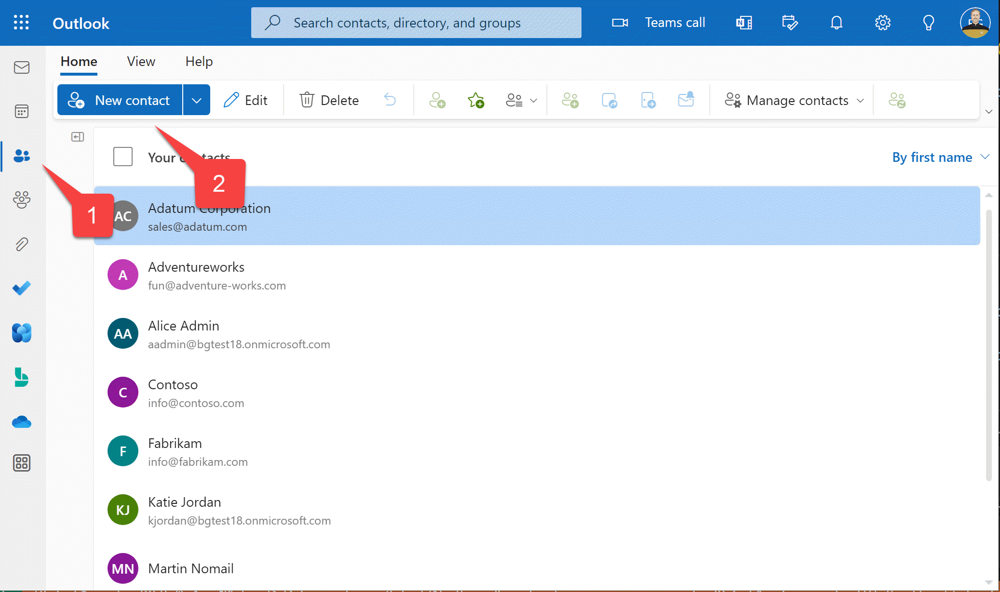

# Lab 5: Single Sign-on and Microsoft Graph

> #### 실습 계획 
> 
> * [**Lab 1 - Create your first app with Teams Toolkit**](./2024-01-02-1.create-app.html) 이 랩에서는 Teams Toolkit을 설정하고 Teams 메시지 확장을 만드는 방법을 알아보겠습니다.
> * [**Lab 2 - Integrate business data with your application**](./2024-01-03-2.integrate-web-service.html) 이 실습에서는 새로운 앱을 'Northwind Suppliers’라고 브랜딩하고, Microsoft Teams 대화에서 Northwind Traders 샘플 데이터베이스의 데이터를 삽입할 수 있는 기능을 제공합니다. 또한 메시지 확장을 사용하여 어댑티브 카드를 생성하고 전송하는 방법을 배우게 됩니다.
> * [**Lab 3 - Add link unfurling**](./2024-01-04-3.add-link-unfurling.html) 이 랩에서는 사용자가 대화에 URL을 포함할 때 사용자 정의 요약을 제공하는 링크 언퍼링 기능을 사용하는 방법을 배우게 됩니다.
> * [**Lab 4 - Action message extensions with Open AI**](./2024-01-05-4.add-ai.html) 이 랩에서는 “액션” 메시지 확장 기능을 만드는 방법을 배울 수 있습니다. 이 기능은 직접 실행하거나 다른 팀 메시지의 컨텍스트 메뉴에서 실행하여 해당 메시지에 대한 작업을 수행할 수 있습니다. 이 랩에서는 Open AI 상업 웹 서비스(Azure 또는 Open AI 계정을 사용하여)를 이용하여 메시지를 생성합니다.
> *  [**Lab 5 - Single Sign-on and Microsoft Graph**](./2024-01-06-5.add-sso.html) 이 실습에서는 Azure AD Single Sign-On을 사용하여 사용자를 인증하고 Microsoft Graph API를 호출하는 방법을 배웁니다. 이와 같은 과정은 로그인한 사용자를 대신하여 Azure AD로 보호되는 웹 서비스를 호출할 때 사용됩니다.
> * [**Lab 6 - Run the app in Outlook**](./2024-01-07-6.run-in-outlook.html) 이 랩에서는 Microsoft Outlook에서 Northwind Suppliers 애플리케이션을 실행합니다.
{: .block-tip }

## Overview

이 랩에서는 다음을 배우게 됩니다:

- 앱에 Azure Active Directory 단일 로그인(SSO)을 추가하여 사용자가 Microsoft Teams에서 사용하는 동일한 계정으로 앱에 원활하게 로그인할 수 있습니다.
- Teams 메시지 확장이나 봇에서 Azure Active Directory로 보호되는 REST 서비스에 액세스합니다.
- [Microsoft Graph API](https://learn.microsoft.com/graph/use-the-api){:target="_blank"}를 사용하여 Microsoft 365에서 사용자 콘텐츠에 액세스합니다. 앱은 로그인한 사용자를 대신하여 작동하여 사용자가 애플리케이션 내에서 자신의 콘텐츠에 안전하게 액세스할 수 있습니다.

## Features

이번 실습에서는 사용자의 개인 연락처 목록을 쿼리하고 Teams 대화에서 연락처를 공유할 수 있는 Search 메시지 확장을 만들어 보겠습니다. 

## Exercise 1: Set up your project for Azure AD Single Sign-on

Azure Active Directory로 보호되는 애플리케이션은 _등록_되고 _권한_을 부여받아야 합니다. Teams Toolkit은 이 작업을 대신 해줍니다. 하지만 프로젝트를 업데이트해야만 합니다. 이 연습에서는 Teams Toolkit 프로젝트 파일을 수정하여 Azure AD에 앱 등록을 프로비저닝할 것입니다.

> #### More information
> 
> 

>    <iframe src="//www.youtube.com/embed/SaBbfVgqZHc" frameborder="0" allowfullscreen></iframe>
>    
Understanding Single Sign-On (SSO) with Azure AD

> 

> 

>   <iframe src="//www.youtube.com/embed/RjGVOFm39j0" frameborder="0" allowfullscreen></iframe>
>   
Learn about multi-tenant applications

> 

{: .block-tip }

### Step 1: Add an Azure AD App manifest file to define the Azure AD Application

이 단계에서는 Teams Toolkit이 애플리케이션에 등록할 애플리케이션을 정의하는 파일을 추가합니다. AAD 매니페스트를 사용하면 애플리케이션 등록의 다양한 측면을 사용자 정의할 수 있습니다. 예를 들어, 이 매니페스트는 앱이 사용자의 연락처를 읽을 수 있도록 Microsoft Graph API에 `contacts.read` 권한을 설정합니다.

프로젝트 폴더의 루트에 **aad.manifest.json** 파일을 생성하고, 다음 JSON을 붙여넣으세요:

~~~json
{
  "id": "${{AAD_APP_OBJECT_ID}}",
  "appId": "${{AAD_APP_CLIENT_ID}}",
  "name": "NorthwindSuppliers-AAD",
  "accessTokenAcceptedVersion": 2,
  "signInAudience": "AzureADMyOrg",
  "optionalClaims": {
      "idToken": [],
      "accessToken": [
          {
              "name": "idtyp",
              "source": null,
              "essential": false,
              "additionalProperties": []
          }
      ],
      "saml2Token": []
  },
  "requiredResourceAccess": [
      {
          "resourceAppId": "Microsoft Graph",
          "resourceAccess": [
              {
                  "id": "Contacts.Read",
                  "type": "Scope"
              }
          ]
      }
  ],
  "oauth2Permissions": [
      {
          "adminConsentDescription": "Allows Teams to call the app's web APIs as the current user.",
          "adminConsentDisplayName": "Teams can access app's web APIs",
          "id": "${{AAD_APP_ACCESS_AS_USER_PERMISSION_ID}}",
          "isEnabled": true,
          "type": "User",
          "userConsentDescription": "Enable Teams to call this app's web APIs with the same rights that you have",
          "userConsentDisplayName": "Teams can access app's web APIs and make requests on your behalf",
          "value": "access_as_user"
      }
  ],
  "preAuthorizedApplications": [
      {
          "appId": "1fec8e78-bce4-4aaf-ab1b-5451cc387264",
          "permissionIds": [
              "${{AAD_APP_ACCESS_AS_USER_PERMISSION_ID}}"
          ]
      },
      {
          "appId": "5e3ce6c0-2b1f-4285-8d4b-75ee78787346",
          "permissionIds": [
              "${{AAD_APP_ACCESS_AS_USER_PERMISSION_ID}}"
          ]
      },
      {
          "appId": "d3590ed6-52b3-4102-aeff-aad2292ab01c",
          "permissionIds": [
              "${{AAD_APP_ACCESS_AS_USER_PERMISSION_ID}}"
          ]
      },
      {
          "appId": "00000002-0000-0ff1-ce00-000000000000",
          "permissionIds": [
              "${{AAD_APP_ACCESS_AS_USER_PERMISSION_ID}}"
          ]
      },
      {
          "appId": "bc59ab01-8403-45c6-8796-ac3ef710b3e3",
          "permissionIds": [
              "${{AAD_APP_ACCESS_AS_USER_PERMISSION_ID}}"
          ]
      },
      {
          "appId": "0ec893e0-5785-4de6-99da-4ed124e5296c",
          "permissionIds": [
              "${{AAD_APP_ACCESS_AS_USER_PERMISSION_ID}}"
          ]
      },
      {
          "appId": "4765445b-32c6-49b0-83e6-1d93765276ca",
          "permissionIds": [
              "${{AAD_APP_ACCESS_AS_USER_PERMISSION_ID}}"
          ]
      },
      {
          "appId": "4345a7b9-9a63-4910-a426-35363201d503",
          "permissionIds": [
              "${{AAD_APP_ACCESS_AS_USER_PERMISSION_ID}}"
          ]
      }
  ],
  "identifierUris": [
    "api://botid-${{BOT_ID}}"
  ],
  "replyUrlsWithType": [
    {
      "url": "https://${{BOT_DOMAIN}}/auth-end.html",
      "type": "Web"
    }
  ]
}
~~~

### Step 2: Update Teams Toolkit configuration file to create the Azure AD App

**teamsapp.local.yml** 파일을 엽니다. 이 파일은 YAML 파일로, Teams Toolkit이 프로젝트를 실행하기 위해 수행하는 단계를 정의합니다. 이 단계는 Teams Toolkit 사용자 인터페이스의 "LIFECYCLE" 섹션에 표시된 대로 3단계로 이루어집니다.

  * Provision - 이 단계에서는 앱에 필요한 인프라가 프로비저닝됩니다. 이에는 봇 등록, Teams 앱 패키지, 그리고 이 경우 Azure AD 앱 등록과 같은 것들이 포함됩니다.

  * Deploy - 이 단계에서는 코드가 빌드되고 로컬에서 실행되거나, “local” 이외의 환경의 경우 Azure에 업로드됩니다.

  * Publish - 이 단계에서는 앱 패키지가 Microsoft Teams에 게시됩니다.

Azure AD 앱을 프로비저닝하기 위해, **teamsapp.local.yml** 파일에 다음 줄들을 추가합니다. `provision:` 줄 바로 아래에 넣을 수 있습니다. YAML을 알고 있다면 [teamsApp/validateManifest] 지시문 전 어디든 넣을 수 있습니다. 왜냐하면 Azure AD 앱 정보는 매니페스트를 검증하는 데 필요하기 때문입니다.

~~~yaml
- uses: aadApp/create
    with:
        name: "NorthwindSuppliers-AAD"
        generateClientSecret: true
        signInAudience: "AzureADMyOrg"
    writeToEnvironmentFile:
        clientId: AAD_APP_CLIENT_ID
        clientSecret: SECRET_AAD_APP_CLIENT_SECRET
        objectId: AAD_APP_OBJECT_ID
        tenantId: AAD_APP_TENANT_ID
        authority: AAD_APP_OAUTH_AUTHORITY
        authorityHost: AAD_APP_OAUTH_AUTHORITY_HOST

- uses: aadApp/update
    with:
        manifestPath: "./aad.manifest.json"
        outputFilePath : ./build/aad.manifest.${{TEAMSFX_ENV}}.json
~~~

> #### YAML은 적절한 들여쓰기가 필요합니다. 
>
> 객체 계층 구조의 각 레벨은 구조를 나타내기 위해 들여쓰기되어야 합니다. 2개의 공백(탭이 아님)이 좋은 선택입니다. Visual Studio Code는 여기에서 도움을 줄 것이며, 구문 오류를 빨간색으로 강조 표시합니다. 빨간 줄이 사라지면 올바르게 작성한 것입니다!
{: .block-tip }

`deploy` 단계에서 `file/createOrUpdateEnvironmentFile` 지시문을 찾아서 이전 랩에서 추가한 것 바로 아래에 다음 변수를 `envs:` 컬렉션에 추가하세요:

~~~yaml
M365_CLIENT_ID: ${{AAD_APP_CLIENT_ID}}
M365_CLIENT_SECRET: ${{SECRET_AAD_APP_CLIENT_SECRET}}
M365_TENANT_ID: ${{AAD_APP_TENANT_ID}}
INITIATE_LOGIN_ENDPOINT: ${{BOT_ENDPOINT}}/auth-start.html
M365_AUTHORITY_HOST: ${{AAD_APP_OAUTH_AUTHORITY_HOST}}
M365_APPLICATION_ID_URI: api://botid-${{BOT_ID}}
~~~

## Exercise 2: Update your Teams app manifest for SSO

단일 로그인 프로세스에서 Teams는 애플리케이션에 대한 Azure AD 액세스 토큰을 코드에 제공합니다. 이 액세스 토큰은 자체 백엔드 서비스에 대한 호출을 승인하는 데 사용할 수 있거나 Microsoft Graph와 같은 다른 백엔드 서비스에서 사용되는 액세스 토큰으로 교환할 수 있습니다.

그러나 Teams는 애플리케이션에 대해 알지 못하면 이 액세스 토큰을 제공할 수 없습니다. 구체적으로 Teams는 애플리케이션(client) ID와 Teams에 연결된 봇의 ID를 알아야합니다. 따라서 Teams 앱 매니페스트에 이 정보를 추가해야합니다.

**./appPackage/manifest.json**에서 Teams 앱 매니페스트 템플릿을 찾아 다음을 추가하십시오:

~~~json
	"webApplicationInfo": {
	  "id": "${{AAD_APP_CLIENT_ID}}",
	  "resource": "api://botid-${{BOT_ID}}"
    }
~~~

So you need to add your bot's domain, `${{BOT_DOMAIN}}` to the `validDomains` array. 
After making these changes, the end of your **manifest.json** file should look like this:

`"validDomains"` 객체 아래에 쉼표를 넣어 추가하세요.

여기서 우리는 Teams에게 봇 도메인에서 웹 페이지를 표시하도록 알려줘야합니다. 이렇게 하면 사용자가 Microsoft Graph를 호출하기 위해 사용되는 **auth-start.html** 및 **auth-end.html** 페이지에 대한 사용자 동의를 위한 접근 권한이 부여됩니다. 이는 사용자가 메시지 확장에 처음 액세스 할 때만 발생합니다.

따라서 `validDomains` 배열에 봇 도메인 `${{BOT_DOMAIN}}`을 추가해야합니다. 이러한 변경 사항을 수행 한 후 **manifest.json** 파일의 끝은 다음과 같아야합니다:

~~~json
    "validDomains": [ "adaptivecards.io", "${{BOT_DOMAIN}}"
    ],
    "webApplicationInfo": {
        "id": "${{AAD_APP_CLIENT_ID}}",
        "resource": "api://botid-${{BOT_ID}}"
  }
}
~~~

## Exercise 3: (Optional) Update the project for Azure deployment

Microsoft Azure에 프로젝트를 배포하려면 Teams Toolkit에서 로컬 환경뿐만 아니라 거기에도 SSO를 설정하도록 몇 가지 변경 사항을 추가해야합니다. Microsoft Azure에 배포할 계획이 없으면 다음 연습으로 건너 뛸 수 있습니다.

### Step 1: Update Teams Toolkit configuration file to create the Azure AD App during Azure deployment

**teamsapp.yml** 파일을 엽니다. 이것은 Teams Toolkit이 프로젝트를 Microsoft Azure에서 프로비저닝 할 때 수행하는 단계를 정의하는 YAML 파일입니다. 이전에 **teamsapp.local.yml**에서 수행한 것과 동일한 수정을 여기에서 수행합니다.

구체적으로 **teamsapp.yml**에 다음 줄을 추가해야합니다. `provision:` 아래에 직접 넣을 수 있습니다. YAML을 알고 있다면 Azure AD 애플리케이션 정보가 매니페스트를 확인하는 데 필요하기 때문에 [teamsApp/validateManifest] 지시문 이전 어디에나 넣을 수 있습니다.

~~~yaml
  - uses: aadApp/create
    with:
      name: "NorthwindSuppliers-AAD"
      generateClientSecret: true
      signInAudience: "AzureADMyOrg"
    writeToEnvironmentFile:
      clientId: AAD_APP_CLIENT_ID
      clientSecret: SECRET_AAD_APP_CLIENT_SECRET
      objectId: AAD_APP_OBJECT_ID
      tenantId: AAD_APP_TENANT_ID
      authority: AAD_APP_OAUTH_AUTHORITY
      authorityHost: AAD_APP_OAUTH_AUTHORITY_HOST
  
  - uses: aadApp/update
    with:
      manifestPath: "./aad.manifest.json"
      outputFilePath : ./build/aad.manifest.${{TEAMSFX_ENV}}.json
~~~

### Step 2: Add Azure AD configuration values to the Azure parameters file

**infra/azure.parameters.json** 파일을 열고 `parameters` 객체에 이러한 속성을 추가하십시오. `"botDisplayName"` 속성 뒤에 쉼표를 추가하여 이러한 새 속성을 구분하는 것을 잊지 마십시오.

~~~json
    "m365ClientId": {
      "value": "${{AAD_APP_CLIENT_ID}}"
    },
    "m365ClientSecret": {
      "value": "${{SECRET_AAD_APP_CLIENT_SECRET}}"
    },
    "m365TenantId": {
      "value": "${{AAD_APP_TENANT_ID}}"
    },
    "m365OauthAuthorityHost": {
      "value": "${{AAD_APP_OAUTH_AUTHORITY_HOST}}"
    }
~~~

### Step 3: Update the Bicep file

Teams Toolkit는 Microsoft Azure에 애플리케이션을 배포하기 위해 [Bicep](https://learn.microsoft.com/azure/azure-resource-manager/bicep/overview){:target="_blank"}를 사용합니다. 이 단계에서는 애플리케이션을 호스팅할 Azure App Service의 Azure AD 설정을 설정하기 위해 bicep 파일을 업데이트합니다.

**infra/azure.bicep** 파일을 열고 다음 줄을 찾으세요:

~~~bicep
param location string = resourceGroup().location
~~~

그 줄 아래에 이 줄들을 추가하세요.

~~~bicep
	param m365ClientId string
	param m365TenantId string
	param m365OauthAuthorityHost string
	param m365ApplicationIdUri string = 'api://botid-${botAadAppClientId}'
	@secure() param m365ClientSecret string
~~~

이제 bicep 파일의 맨 아래로 스크롤하십시오. `output` 라인이 맨 아래에 있음을 알 수 있습니다. 그들 앞에 다음 줄을 삽입하여 앱 서비스의 속성을 설정하십시오:

~~~bicep
resource webAppSettings 'Microsoft.Web/sites/config@2021-02-01' = {
    name: '${webAppName}/appsettings'
    properties: {
    M365_CLIENT_ID: m365ClientId
    M365_CLIENT_SECRET: m365ClientSecret
    INITIATE_LOGIN_ENDPOINT: uri('https://${webApp.properties.defaultHostName}', 'auth-start.html')
    M365_AUTHORITY_HOST: m365OauthAuthorityHost
    M365_TENANT_ID: m365TenantId
    M365_APPLICATION_ID_URI: m365ApplicationIdUri
    BOT_ID: botAadAppClientId
    BOT_PASSWORD: botAadAppClientSecret
    RUNNING_ON_AZURE: '1'
    }
}
~~~

## Exercise 4: Update the application code for SSO

이 연습에서는 코드를 수정하여 SSO 프로세스를 수용하도록합니다. 이 단계는 어떤 메시지 확장에도 사용됩니다. 개인 연락처를 공유하는 새로운 기능은 Exercise 5에서 추가됩니다.

### Step 1: Provide HTML pages for the consent dialog

사용자가 응용 프로그램에 처음 액세스 할 때 앱이 개인 연락처를 읽을 권한을 부여하는 데 동의해야 할 수 있습니다. 이 작업은 곧 추가 할 [TeamsFx library]()에서 수행됩니다. TeamsFx는 팝업 창을 표시합니다. 이 HTML 페이지는 해당 팝업에서 표시되어 Azure AD로 실제 동의를 수행합니다.

프로젝트 루트에 **public**이라는 새 폴더를 만드십시오.

**auth-start.html** 파일을 만들고 [Teams Toolkit에서 가져온](https://github.com/OfficeDev/TeamsFx/blob/main/packages/fx-core/templates/plugins/resource/aad/auth/bot/js/public/auth-start.html){:target="_blank"} 내용을 붙여넣으세요.

**auth-end.html** 파일을 만들고 [Teams Toolkit에서 가져온](https://github.com/OfficeDev/TeamsFx/blob/main/packages/fx-core/templates/plugins/resource/aad/auth/bot/js/public/auth-end.html){:target="_blank"} 내용을 붙여넣으세요.

> #### GitHub에서 복사하는 빠른 방법
> 
> 파일 내용을 한 번의 클릭으로 복사하는 “Copy raw contents” 버튼이 왼쪽 상단에 있습니다.
> 
{: .block-tip }

### Step 2: Install packages

SSO 프로세스의 일부로 애플리케이션은 두 개의 npm 패키지를 사용합니다:
  * [isomorphic-fetch](https://www.npmjs.com/package/isomorphic-fetch){:target="_blank"} - 이 패키지는 앱의 액세스 토큰을 Microsoft Graph 액세스 토큰으로 교환할 때 Azure Active Directory에 웹 서비스 호출을 수행하는 데 사용됩니다.
  * [@microsoft/teamsfx](https://learn.microsoft.com/microsoftteams/platform/toolkit/teamsfx-sdk){:target="_blank"} - 이 패키지는 SSO 코드를 단순화하고 필요한 경우 동의 대화 상자를 시작합니다.

프로젝트 폴더의 루트에서 다음 명령 줄을 입력하세요.

~~~sh
npm install @microsoft/teamsfx isomorphic-fetch
~~~

### Step 3: Update your index.js file to handle SSO interactions

**index.js** 파일을 열고, 이것은 당신의 봇의 웹 서비스의 주요 진입점입니다. 다음 줄을 맨 위에 추가하세요:

~~~javascript
require("isomorphic-fetch");
const path = require("path");
~~~

봇의 메시지를 처리하는 코드를 찾으세요:

~~~javascript
// Listen for incoming requests.
server.post("/api/messages", async (req, res) => {
  await adapter.process(req, res, async (context) => {
    await bot.run(context);
  });
});
~~~

다음 코드로 대체하세요. 새 코드는 [412] ;[HTTP 상태 코드](https://http.cat){:target="_blank"} "Precondition not met"를 감지할 수 있는 기능을 추가합니다. 이 코드는 TeamsFx에서 사용자가 요청한 권한에 동의하지 않은 경우 발생하는 상황이며, 이는 동의 대화 상자가 나타나는 상황입니다. 그리고 우리 코드는 그 오류를 catch해서는 안 되며, 그렇게 하면 실행이 중지되고 TeamsFx의 대화 상자 코드가 실행되지 않습니다.

새 코드는 또한 이전에 추가한 인증 HTML 페이지를 제공하는 `get` 요청 핸들러를 추가합니다.

~~~javascript
// Listen for incoming requests.
server.post("/api/messages", async (req, res) => {
    await adapter.process(req, res, async (context) => {
    await bot.run(context);
    }).catch((err) => {
    // Error message including "412" means it is waiting for user's consent, which is a normal process of SSO, shouldn't throw this error.
    if(!err.message.includes("412")) {
        throw err;
        }
    })
});

server.get(
    "/auth-:name(start|end).html",
    restify.plugins.serveStatic({
    directory: path.join(__dirname, "public"),
    })
);
~~~

## Exercise 5: Add the Contacts message extension

이제 SSO에 대한 기본 작업을 마쳤으므로, 사용자의 개인 연락처에 액세스하기 위해 Microsoft Graph API를 호출하는 새로운 Contacts 메시지 확장을 구현할 것입니다. 이를 통해 사용자는 Teams에서 연락처를 공유할 수 있습니다.

### Step 1: Add the Contacts message extension code

**messageExtensions** 디렉터리 내에서 **contactME.js**라는 새 파일을 추가하고 다음 코드를 붙여넣으십시오:

~~~javascript
const axios = require("axios");
const ACData = require("adaptivecards-templating");
const { CardFactory } = require("botbuilder");

const {
    createMicrosoftGraphClientWithCredential,
    OnBehalfOfUserCredential,
    handleMessageExtensionQueryWithSSO
} = require("@microsoft/teamsfx");
require("isomorphic-fetch");

const oboAuthConfig = {
    authorityHost: process.env.M365_AUTHORITY_HOST,
    clientId: process.env.M365_CLIENT_ID,
    tenantId: process.env.M365_TENANT_ID,
    clientSecret: process.env.M365_CLIENT_SECRET,
};
const initialLoginEndpoint = process.env.INITIATE_LOGIN_ENDPOINT;

class ContactME {

    // Get contacts given a query
    async handleTeamsMessagingExtensionQuery (context, query) {
        return await handleMessageExtensionQueryWithSSO(context, oboAuthConfig, initialLoginEndpoint,
            "Contacts.Read",
            async (token) => {
              return await this.#queryContacts(context, query, token);
            });
    }

    // Get contacts given a query and an access token for the Microsoft Graph
    async #queryContacts (context, query, token) {

        try {

            // Init OnBehalfOfUserCredential instance with SSO token
            const credential = new OnBehalfOfUserCredential(token.ssoToken, oboAuthConfig);

            // Add scope for your Azure AD app. For example: Mail.Read, etc.
            const graphClient = createMicrosoftGraphClientWithCredential(credential, "Contacts.Read");

            // Call graph api use `graph` instance to get user profile information.
            const response = await graphClient.api("/me/contacts?$select=id,displayName,emailAddresses").get();

            // Since Graph doesn't allow sorting and filtering of contacts, do it here
            // TODO: Handle multiple pages of contacts
            let contacts = response.value.filter( contact => 
                contact.displayName.toLowerCase().includes(query.toLowerCase()));

            // Sort contacts by display name
            contacts = contacts.sort((a, b) => (a.displayName > b.displayName) ? 1 : -1);

            const attachments = [];
            contacts.forEach((contact) => {

                const itemAttachment = CardFactory.heroCard(contact.displayName,);
                const previewAttachment = CardFactory.thumbnailCard(contact.displayName);

                previewAttachment.content.tap = {
                    type: "invoke",
                    value: {    // Values passed to selectItem when an item is selected
                        queryType: 'contactME',
                        id: contact.id,
                        displayName: contact.displayName,
                        email: contact.emailAddresses[0]?.address
                    },
                };
                const attachment = { ...itemAttachment, preview: previewAttachment };
                attachments.push(attachment);
            });

            return {
                composeExtension: {
                    type: "result",
                    attachmentLayout: "list",
                    attachments: attachments,
                }
            };

        } catch (error) {
            console.log(error);
        }
    };

    handleTeamsMessagingExtensionSelectItem (context, item) {

        const resultCard = CardFactory.heroCard(item.displayName, item.email);

        return {
            composeExtension: {
                type: "result",
                attachmentLayout: "list",
                attachments: [resultCard]
            },
        };
    };
}

module.exports.ContactME = new ContactME();
~~~

> #### 코드 설명
> 
> 코드를 추가한 것을 잠시 검토해보세요.
>
> `handleTeamsMessagingExtensionQuery()` 함수는 사용자가 메시지 확장에 쿼리를 입력하면 호출됩니다. 이 요청을 충족하기 위해 액세스 토큰이 필요하므로 TeamsFx 함수 `handleTeamsMessagingExtensionQueryWithSSO()`를 호출하여 반환합니다. 이 함수는 사용자가 권한에 동의하지 않은 경우 동의 대화 상자를 표시하는 작업을 처리합니다.
>    
> `oboAuthConfig`라는 인수가 포함되어 있으며, 이 인수에는 Teams에서 제공한 액세스 토큰을 다른 응용 프로그램(예: Microsoft Graph)의 웹 서비스에 대한 액세스 토큰으로 교환하는 데 필요한 정보가 포함되어 있습니다. 이는 `handleTeamsMessagingExtensionQueryWithSSO()`에서 사용되며, Microsoft Graph를 호출하기 위한 Graph 클라이언트를 가져 오기 위해 호출하는 `OnBehalfOfUserCredential()`에서도 사용됩니다.
>
> Graph 클라이언트를 얻으면 Graph API를 호출하고 클라이언트 목록을 가져오는 것이 간단합니다. 이와 같은 Graph API 호출을 대화 형으로 시도하려면 [Graph Explorer](https://developer.microsoft.com/graph/graph-explorer){:target="_blank"}를 사용해보세요. Microsoft Graph를 호출하는 코드를 작성할 때 시작하기에 좋은 장소입니다.
{: .block-tip }

### Step 2: Modify the bot to displatch messages to the Contacts message extension

**teamsBot.js** 파일을 열고 쿼리 메시지 확장을 위한 `switch` 문에 연락처 메시지 확장 호출을 추가하세요.

파일 상단 근처에 연락처 메시지 확장 모듈을 가져오기 위한 `require` 문을 추가하세요.

~~~javascript
const { ContactME } = require("./messageExtensions/contactME");
~~~

`handleTeamsMessagingExtensionQuery` 함수에서, switch 문에 다른 case를 추가하세요:

~~~javascript
    case "contactME":  // Search for contacts
        return await ContactME.handleTeamsMessagingExtensionQuery(context, searchQuery);
~~~

`handleTeamsMessagingExtensionSelectItem` 함수에서, switch 문에 다른 case를 추가하세요:

~~~javascript
      case "contactME":  // Search for contacts
        return ContactME.handleTeamsMessagingExtensionSelectItem(context, item);
~~~

### Step 3: Add the Contacts message extension to the Teams app manifest

**appPackage/manifest.json** 파일을 편집하고 `replyToMessage` 명령어 다음에 `commands` 배열에 새로운 항목을 추가하세요.

~~~json
{ 
        "id": "searchContacts", 
        "context": [ 
            "compose", 
            "commandBox" 
        ], 
        "description": "Share a contact", 
        "title": "Contact search", 
        "type": "query", 
        "parameters": [ 
            { 
                "name": "contactME", 
                "title": "Contact search", 
                "description": "Type name or company", 
                "inputType": "text" 
            } 
        ] 
} 
~~~

> #### Tip
>
> 모든 중첩된 괄호가 조금 혼란스럽다면, 전체 업데이트된 **manifest.json** 파일을 [여기서](https://github.com/microsoft/app-camp/blob/main/src/teams-toolkit/Lab05-Lab05-ConsumeGraphAPI/NorthwindSuppliers/appPackage/manifest.json){:target="_blank"} 복사해도 좋습니다.
{: .block-tip }

## Exercise 6: Run the application

### Step 1: Enter test data

메시지 확장을 사용하려면 Microsoft 365에 연락처가 있어야 합니다. 연락처가 없으면 메시지 확장에서 연락처를 표시할 수 없습니다! 그러니 Microsoft 365에 몇 명의 연락처를 추가하는 것을 잊지 마세요.

1️⃣ Microsoft Teams에서 “와플” 메뉴를 클릭하세요.

2️⃣ Microsoft Outlook을 선택하세요.

1️⃣ Outlook에서 “연락처” 버튼을 클릭하세요.

2️⃣ 새로운 연락처를 입력하세요.

이 앱은 간단하게 사용할 수 있으며, 사람이나 회사 이름과 이메일 주소만 표시합니다. 비즈니스 시나리오에 따라서 연락처를 공급업체처럼 만들고 싶다면 그렇게 해보세요.

### Step 2: Run the application

팀스 툴킷에서 F5 키를 누르거나 "실행" 메뉴를 사용하거나 실행 화살표를 클릭하세요. 브라우저가 열리고 설치 대화 상자가 나타나면 애플리케이션을 추가하세요.

이제 메시지 확장에는 검색을 위한 두 개의 탭이 있습니다.

1️⃣ "연락처 검색" 탭을 클릭하세요

2️⃣ 1단계에서 입력한 연락처 이름에 포함된 한 글자 이상을 입력하세요

이 작업을 처음 수행하면 TeamsFx는 아무도 앱 권한에 동의하지 않았다는 것을 인식하고 로그인하도록 메시지를 표시합니다.

3️⃣ 로그인 링크를 클릭하여 진행하세요

[Developer Tunnels](https://code.visualstudio.com/docs/remote/tunnels)을 사용하여 로컬에서 실행 중이므로 경고 화면이 나타납니다. 앱을 배포하면 사용자는 이 화면을 보지 못합니다.

Click "Accept" to consent to the permissions and run the message extension

"계속"을 클릭하면 Azure AD로 리디렉션되고 앱의 권한에 동의하라는 메시지가 나타납니다. (**public/auth-start.html**에 의해 이곳으로 이동되었습니다. TeamsFx는 동의하지 않은 것을 발견했을 때 이 파일을 표시했습니다.) Microsoft 365 관리자이므로 테넌트의 모든 사용자를 대신하여 동의할 수 있는 옵션도 제공됩니다.

권한에 동의하고 메시지 확장을 실행하려면 "수락"을 클릭하세요

이제 검색 문자열을 포함하는 연락처 목록이 나타납니다.

연락처 정보가 들어있는 히어로 카드를 팀스 대화에 삽입하려면 연락처 중 하나를 클릭하세요.

## Next steps

이제 실습의 대부분을 마쳤습니다. [다음 실습](./2024-01-06-6.run-in-outlook.html)에서는 Microsoft Outlook에서 Northwind Suppliers 앱을 실행해 보겠습니다. 코드를 변경할 필요는 없습니다.

## Known issues

최신 문제점이나 버그 리포트를 보려면 이 저장소의 [GitHub issues](https://github.com/microsoft/app-camp/issues){:target="_blank"} 목록을 참조하세요.
